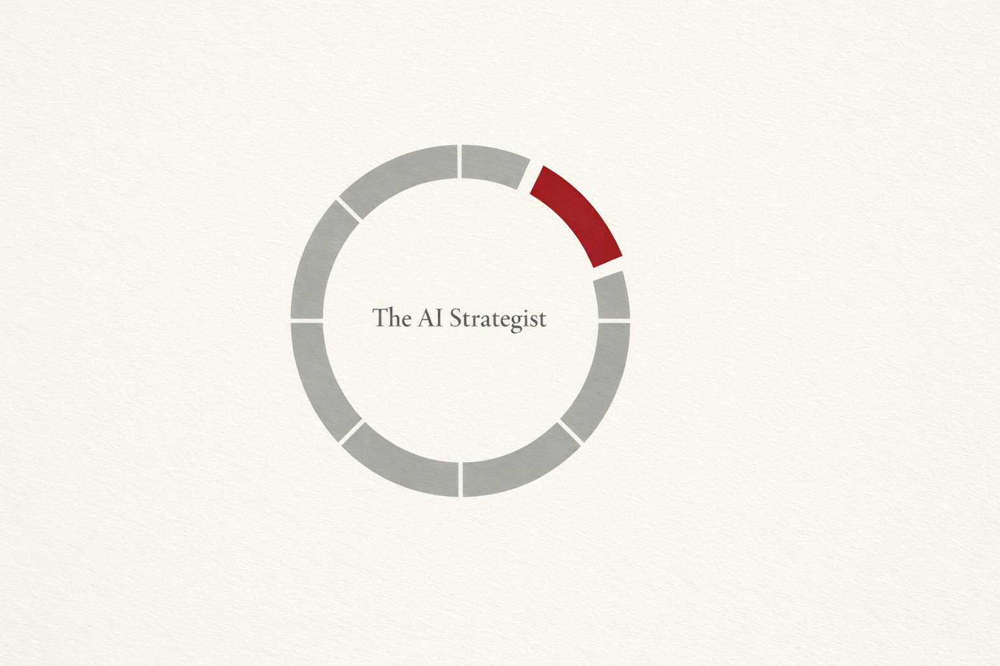

# The AI Strategist

**Defining a New Role at the Intersection of AI, Business Strategy, and Execution**

  

---

## 📖 Overview

The term "AI Strategist" appears in over 400 job listings worldwide. Yet no government agency, no consulting firm, no academic institution, and no standards body has formally defined this role.

This book fills that void.

Not an AI Engineer. Not a Data Scientist. Not an AI Consultant. Not a CAIO. 
Through structural analysis, this book proves the gap that existing roles cannot cover, and defines what an AI Strategist is — why the role is needed, what it requires, and how it functions.

---

## 🏗️ Structure

This book consists of 3 parts and 7 chapters.

### Part I: Why a New Role Is Needed Now

| Ch. | Title | Content |
|-----|-------|---------|
| 1 | The Relationship Between AI and Organizations Has Changed | AI has evolved from "tool" to "autonomous agent," fundamentally altering organizational decision-making structures |
| 2 | No One Has Filled This Gap | Gap analysis of 6 existing roles. Structural reference to Palantir's FDE (Forward Deployed Engineer) model |

### Part II: What Is an AI Strategist

| Ch. | Title | Content |
|-----|-------|---------|
| 3 | Three Principles | Vendor Independence, Outcome Commitment, Embedded Engagement |
| 4 | Competency Model | Three layers (AI Literacy at Depth, Business Architecture, Execution through Methodology) + Boundary-Spanning foundation |
| 5 | Differentiation from Adjacent Roles | Structural proof through principle and competency matrices |

### Part III: How the AI Strategist Functions

| Ch. | Title | Content |
|-----|-------|---------|
| 6 | Organizational Placement and Function | Three deployment patterns (Internal, Embedded External/FDE-type, Strategic Advisory) and stakeholder relationship design |
| 7 | Measuring Outcomes and the Ultimate Goal | Outcome-based measurement. The ultimate goal: building an organization that can drive its own AI strategy autonomously |

---

## 📄 Documents

| File | Language | Content |
|------|----------|---------|
| [the-ai-strategist_jp.md](./docs/ja/the-ai-strategist_jp.md) | 🇯🇵 Japanese | Full text (Japanese) |
| [the-ai-strategist_en.md](./docs/en/the-ai-strategist_en.md) | 🇺🇸 English | Full text (English) |

---

## 🔑 Core Framework

### Three Principles

1. **Vendor Independence** 
   Structural independence from any specific AI vendor or platform, enabling objective technology selection optimized for the client's needs

2. **Outcome Commitment** 
   Commitment to delivering business outcomes, not reports. Just as Palantir's FDEs "ship code, not slide decks," AI Strategists ship business results, not advisory documents

3. **Embedded Engagement** 
   Engaging from within the client's environment to directly understand problems and drive solutions, rather than observing from the outside

### Competency Model (4-Layer Structure)

| Layer | Name | Description |
|-------|------|-------------|
| Layer 1 | AI Literacy at Depth | Understanding structural principles of AI: Scaling Laws, AI alignment, agentic architectures |
| Layer 2 | Business Architecture | AI-native market analysis, business model design, understanding organizational decision-making structures |
| Layer 3 | Execution through Methodology | Driving execution from prototype validation to business outcomes through reproducible methodologies |
| Foundation | Boundary-Spanning Capability | Translating between technology and business, creative structuring, knowledge systematization and external communication |

---

## 🔗 Related Projects

This book is interconnected with the following open-source projects.

| Project | Description | Link |
|---------|-------------|------|
| **Depth & Velocity** | A practical methodology for new business development in the generative AI era. The execution framework for the AI Strategist's "Execution through Methodology" layer | [GitHub](https://github.com/Leading-AI-IO/depth-and-velocity) |
| **The Silence of Intelligence** | A systematic analysis of Anthropic CEO Dario Amodei's philosophy. Reference for the AI Strategist's "AI Literacy at Depth" layer | [GitHub](https://github.com/Leading-AI-IO/the-silence-of-intelligence) |
| **The Palantir Impact** | A deep dive into Palantir Foundry's Ontology strategy. Structural reference for the FDE model | [GitHub](https://github.com/Leading-AI-IO/palantir-ontology-strategy) |
| **What They Won't Teach You** | A Manifesto on Intergenerational Responsibility in the AI Era | [GitHub](https://github.com/Leading-AI-IO/what-they-wont-teach-you) |
| **The Edge of Intelligence** | Why Open-Weight AI Will Move from Cloud to Your Device, and What It Means for Business and Society | [GitHub](https://github.com/Leading-AI-IO/edge-ai-intelligence) |

---

## 📊 Research-Based Evidence

The definitions in this book are grounded in the following research findings.

- **U.S. OPM (Office of Personnel Management):** Defined 12+ AI work roles in 2024 AI Classification Policy → AI Strategist is not among them
- **EU ESCO:** Covers 2,942 occupations and 13,485 skills → No AI Strategist category
- **Japan METI Digital Skill Standard:** Defines 5 DX human resource types → No AI Strategist
- **Japan IPA IT Skill Standard:** 11 job categories, 38 specializations → No AI Strategist
- **ISO / IEEE / ACM / AAAI:** None have defined AI Strategist
- **MBB (McKinsey, BCG, Bain):** No formal definition published
- **GAFAM + Anthropic + OpenAI:** No formal AI Strategist role established

**No one in the world has defined it. So we define it here.**

---

## 👤 Author

**Satoshi Yamauchi** 
*(Business Designer & AI Strategist at SunAsterisk.inc)* 
**[📒 Read my insights on Note](https://note.com/satoshi_yamauchi).** 
*(Founder / AI Strategist at Leading.AI)* 
This project is part of the research by Leading.AI. 
**[🌐 Visit Leading.AI Official Website](https://www.leading-ai.io/)** 
*(For consulting inquiries and strategic partnership)* 

---

## 📝 License

This work is licensed under a [Creative Commons Attribution 4.0 International License](https://creativecommons.org/licenses/by/4.0/).
© 2026 Satoshi Yamauchi / Leading AI — Licensed under CC BY 4.0
