# The AI Strategist

**Defining a New Role at the Intersection of AI, Business Strategy, and Execution**

  

> This is an open-source book that structurally defines the role of "AI Strategist" — a role that no government agency, no consulting firm, and no academic institution in the world has formally defined.

---

## Table of Contents

- [Chapter 1: The Relationship Between AI and Organizations Has Changed](#chapter-1-the-relationship-between-ai-and-organizations-has-changed)
- [Chapter 2: No One Has Filled This Gap](#chapter-2-no-one-has-filled-this-gap)
- [Chapter 3: Three Principles](#chapter-3-three-principles)
- [Chapter 4: The Competency Model](#chapter-4-the-competency-model)
- [Chapter 5: Differentiation from Adjacent Roles](#chapter-5-differentiation-from-adjacent-roles)
- [Chapter 6: Organizational Placement and Function](#chapter-6-organizational-placement-and-function)
- [Chapter 7: Measuring Outcomes and the Ultimate Goal](#chapter-7-measuring-outcomes-and-the-ultimate-goal)

---

 

# Chapter 1: The Relationship Between AI and Organizations Has Changed

## 1-1. When AI Was a "Tool"

Until 2020, AI was a tool for organizations.

Build a machine learning model. Automate a specific task. Demand forecasting, image classification, fraud detection. Apply a well-defined algorithm to a well-defined problem and produce a measurably precise result. Within this paradigm, AI adoption was a "technology project." Data scientists designed models, AI engineers implemented them, and MLOps engineers maintained them. The C-suite checked the "AI adoption" box, and the IT department handled execution.

This is not to say that strategic thinking about AI was unnecessary in that era. But existing roles could cover it. The CTO made technology selection decisions, data scientists proposed use cases, and management consultants advised on investment decisions. There was no need to define an AI-specific "strategist" as a standalone role.

## 1-2. Three Structural Shifts

From 2022 onward, this relationship changed at its foundation. Three shifts occurred simultaneously across different layers.

### The First Shift: AI Became Something You Talk To

With the arrival of GPT-3.5, GPT-4, Claude, and Gemini, AI became an entity that communicates in natural language. This was a technological shift, but also a shift in who within organizations interacts with AI.

Previously, only engineers touched AI. They called models via Python, hit APIs, and tuned parameters. For non-technical staff, AI was a black box managed by the IT department.

Generative AI erased that barrier. Sales representatives began drafting proposals with AI. Marketers generated campaign copy. Corporate strategy teams used it to create first drafts of market analyses. The interface with AI expanded from the technology department to every function in the organization.

The question this poses to organizations is clear: **"When everyone can use AI, who designs the direction and principles of how AI is used?"**

### The Second Shift: AI Became Something That Executes

AI coding agents, exemplified by Claude Code and GitHub Copilot Workspace, transformed AI's role from "an entity that answers" to "an entity that acts."

Writing code. Running tests. Deploying. Generating documentation. Tasks that once took human engineers days, AI agents now complete in minutes. Anthropic's "Cowork" went further still, presenting a vision of AI operating desktop environments and executing workflows across multiple applications.

This shift directly impacts organizational cost structures and headcount. SaaS adoption decisions change. Development team compositions change. The boundary between outsourcing and in-house development shifts. This is not a "technology problem" — it is a "business problem."

**"If AI can execute, what should humans be deciding?"** — Does your organization have someone who can answer this question?

### The Third Shift: AI Became Something That Informs Decisions

Data platforms, exemplified by Palantir Foundry, have built the infrastructure for integrating all of an organization's data and enabling AI to support decision-making in real time. Palantir calls this concept "Ontology" — a digital representation of an organization's entities (customers, products, transactions, facilities) and their relationships, allowing AI to understand that structure and assist in making decisions accordingly.

This is a different dimension from "data analytics." Analytics organizes past facts. Ontology-based AI intervenes in current operations in real time and supports future decisions.

Detecting supply chain anomalies and proposing alternative routes. Predicting customer churn risk and recommending intervention actions. Optimizing production line utilization in real time. AI has begun entering the core of corporate decision-making.

**"In an era where AI participates in business decisions, who designs the quality of those decisions?"**

## 1-3. The Impact on Organizational Structure

When the three shifts are layered together, a single structural conclusion emerges.

| Shift | AI's Position | Impact on Organizations |
|-------|--------------|------------------------|
| Interlocutor | Everyone interfaces with AI | Need to design AI usage direction and principles |
| Executor | AI performs business tasks | Cost structure, headcount, and build-vs-buy decisions change |
| Decision Support | AI participates in business decisions | Decision-making processes themselves need redesign |

The AI of the past — AI as a "tool" — could be managed by the technology department alone. But with the three shifts occurring simultaneously today, AI adoption has become not a technology project, but an **organizational transformation**.

Organizational transformation requires talent that understands technology while designing business strategy and driving execution.

So, does that talent currently exist within organizations?

The next chapter analyzes six existing roles and proves that **no one** can cover this organizational transformation.

 

# Chapter 2: No One Has Filled This Gap

## 2-1. Analysis of Six Existing Roles

There is no shortage of AI-related talent. AI Engineers, Data Scientists, CAIOs — roles bearing the "AI" label continue to multiply. Yet none of the existing roles can address the structural transformation described in Chapter 1 — the transformation of organizational decision-making structures by AI.

Below, we analyze six major AI-related roles and clarify what each covers and what it cannot.

---

### ① AI Engineer / ML Engineer

**What they cover:** Designing, building, optimizing, and deploying AI models. Constructing training pipelines, optimizing inference, and deploying to production environments.

**What they cannot cover:** Deciding "what to build." AI Engineers are specialists in designing optimal technical solutions for given requirements. But the upstream decisions — "How should AI be applied to this business challenge?" and "Is this even a problem that should be solved with AI?" — fall outside their domain.

Asking an AI Engineer to "design a new business with AI" is like asking an architect "what kind of business should be built on this plot of land." Architects are experts in designing buildings, not business models.

### ② Data Scientist

**What they cover:** Analyzing, visualizing, and extracting insights from data. Building predictive models using statistical methods and machine learning. Discovering meaningful patterns from organizational data.

**What they cannot cover:** Translating discovered insights into "business design." Data Scientists can demonstrate that "this market segment has growth potential." But "how to realize that potential through an AI-native business model" lies outside their scope.

Furthermore, the emergence of generative AI has made knowledge domains fundamentally different from the Data Scientist's traditional core skills (statistical analysis, ML) strategically important — Scaling Laws, large language model architectures, agentic AI. These domains do not lie on the natural extension of data science.

### ③ CAIO (Chief AI Officer)

**What they cover:** Final decision-making for the organization's overall AI strategy. Budget allocation, governance, board reporting. Cross-organizational coordination on AI initiatives.

**What they cannot cover:** Being the hands-on driver of AI strategy "design" and "execution." The CAIO is a C-suite position, and much of their time is consumed by organizational management, board interactions, and governance oversight.

According to IBM's 2025 survey, 26% of organizations have appointed a CAIO. But while the CAIO is "the person who sets the direction," there are many cases where "the person who identifies specific business opportunities based on that direction, designs the methodology, runs prototypes, and delivers results" simply does not exist.

Using a military analogy: the CAIO is the commanding officer. But without a chief of staff to design operations, structure options, and detail execution plans, the commander lacks the material for sound decisions.

### ④ AI Consultant

**What they cover:** Providing AI adoption advice as an external expert. Proposing use cases, recommending technology selections, calculating ROI, and developing implementation roadmaps.

**What they cannot cover:** Two structural limitations exist.

**First, there is no commitment to execution.** The AI Consultant's deliverable is typically a report or slide deck. They deliver advice — "your organization should do this" — and leave execution to the client. But the real difficulty in AI strategy lies not in knowing what to do, but in actually executing and delivering results. Consultants do not cross the chasm between strategy and execution.

**Second, there is a structural susceptibility to vendor bias.** Major consulting firms hold partnerships with specific technology vendors. Accenture maintains deep alliances with Microsoft. Deloitte advances collaborations with AWS and Google Cloud. This partnership structure introduces bias into technology selection. There is a structural risk that recommendations are influenced by the firm's partnerships rather than the client's optimal solution.

### ⑤ AI Product Manager

**What they cover:** Planning and managing the development of AI-powered products. User research, requirements definition, coordination with development teams, release management.

**What they cannot cover:** Their scope is limited to a "single product." AI Product Managers think about "what AI features to incorporate into this product." But the questions "how should AI fundamentally reshape the entire business portfolio?" and "how do we create AI-native new businesses?" exceed the scope of product management.

### ⑥ Digital Transformation Lead / Business Architect

**What they cover:** Driving organizational digitization. Visualizing and improving business processes, deploying digital tools, managing change. In Japan's METI (Ministry of Economy, Trade and Industry) Digital Skill Standard, which defines five types of DX human resources, the Business Architect occupies the most upstream position.

**What they cannot cover:** They lack deep, AI-specific structural understanding. DX initiatives center on "digitizing existing operations," and strategic design based on AI's structural principles — Scaling Laws, agentic architectures, the capabilities and limitations of large language models — does not lie on the extension of DX.

"Digitization" and "AI transformation" are different. Digitization makes existing processes more efficient. AI transformation redesigns the processes themselves — and sometimes eliminates them entirely. Talent that understands this distinction and can design the latter is what is needed.

---

## 2-2. The Structure of the Gap

Layering the analysis of six roles reveals the following gap.

```mermaid
graph TB
    subgraph GAP["<b>🔴 The Gap (AI Strategist)</b>"]
        direction TB
        G["No existing role covers all of:<br/>Structural AI Understanding × Business Design<br/>× Execution × Boundary-Spanning"]
    end

    A["AI Engineer<br/>✅ AI Understanding ✅ Tech Execution<br/>❌ Business Design ❌ Boundary-Spanning"] -.-> GAP
    B["Data Scientist<br/>△ AI Understanding ❌ Business Design<br/>△ Execution ❌ Boundary-Spanning"] -.-> GAP
    C["CAIO<br/>△ AI Understanding ✅ Business Design<br/>△ Execution ✅ Boundary-Spanning"] -.-> GAP
    D["AI Consultant<br/>△ AI Understanding ✅ Business Design<br/>❌ Execution △ Boundary-Spanning"] -.-> GAP
    E["AI PM<br/>△ AI Understanding △ Business Design<br/>✅ Execution △ Boundary-Spanning"] -.-> GAP
    F["DX Lead<br/>❌ AI Understanding ✅ Business Design<br/>△ Execution ✅ Boundary-Spanning"] -.-> GAP

    style GAP fill:#ffcdd2,stroke:#c62828,color:#b71c1c
    style G color:#b71c1c
    style A fill:#e3f2fd,stroke:#1565c0
    style B fill:#e3f2fd,stroke:#1565c0
    style C fill:#fff3e0,stroke:#e65100
    style D fill:#fff3e0,stroke:#e65100
    style E fill:#e8f5e9,stroke:#2e7d32
    style F fill:#e8f5e9,stroke:#2e7d32
```

| Capability | AI Engineer | Data Scientist | CAIO | AI Consultant | AI PM | DX Lead |
|------------|:-----------:|:--------------:|:----:|:-------------:|:-----:|:-------:|
| Deep understanding of AI's structural principles | ○ | △ | △ | △ | △ | ✕ |
| AI-native business design | ✕ | ✕ | ○ | ○ | △ | ○ |
| Methodology-driven execution | ○ (tech) | △ | △ | ✕ | ○ | △ |
| Boundary-spanning between technology and business | ✕ | ✕ | ○ | △ | △ | ○ |

**No existing role achieves ○ across all four capabilities.**

Deeply understanding AI's structural principles (the world of the AI Engineer), designing businesses premised on AI (the world of the management consultant), driving execution with a methodology (the world of the project manager), and connecting all of these across boundaries (the world of the translator) — no role defined anywhere in the world stands at the intersection of these four capabilities.

---

## 2-3. The Gap Also Exists at the Institutional Level

This gap is confirmed not only in practice but in the institutional and academic worlds as well.

### Government Bodies

| Body | Framework | AI Strategist Definition |
|------|-----------|:------------------------:|
| U.S. OPM | AI Classification Policy (2024) | **None** (Defined 12+ AI roles; AI Strategist not among them) |
| EU ESCO | European Skills/Occupations Classification | **None** (Not among 2,942 occupations) |
| Japan METI | Digital Skill Standard | **None** (Not among 5 DX human resource types; unchanged in 2024 GenAI update) |
| Japan IPA | IT Skill Standard | **None** (Not among 11 job categories, 38 specializations) |
| WEF | Future of Jobs Report 2025 | **None** |

### Academic and Research Institutions

Georgetown University's CSET published the most granular AI workforce taxonomy in 2021 (mapping 54 AI-related occupations to SOC codes). AI Strategist is not among them. No formal definition exists in peer-reviewed literature.

### Standards Bodies and Certifications

ISO, IEEE, ACM, and AAAI have not defined AI Strategist. The only existing certifications are IBQMI's "Certified AI Strategist™" (a small-scale online program) and The Case HQ's "Certified AI Business Strategist." Neither holds international authority.

### Consulting Firms and Technology Companies

None of the MBB (McKinsey, BCG, Bain) or Big Four (PwC, EY, KPMG, Deloitte) have published a formal definition. GAFAM, Anthropic, and OpenAI have not established a formal AI Strategist role. AWS's "Generative AI Strategist" is the closest example, but it is an AWS-specific position that lacks vendor independence.

### Thought Leaders

Comparable roles had their "definers." Andrew Ng defined the Chief AI Officer (CAIO) in a 2016 HBR article, and the market adopted it. DJ Patil and Jeff Hammerbacher established the concept of the Data Scientist in its early days.

AI Strategist has no such "definer." No definitive book, no TED Talk, no manifesto.

---

## 2-4. The Palantir FDE Model — Redefining the "External Expert"

In understanding this gap, the FDE (Forward Deployed Engineer) model created by Palantir serves as an important structural reference.

### What Is an FDE?

The FDE was conceived by Palantir in the early 2010s. While conventional software companies "build products and sell them," Palantir established a model of **embedding engineers directly in the client's environment, understanding on-the-ground problems, building solutions, and deploying them to production.**

Palantir's official definition is straightforward: "The responsibilities of an FDE are similar to those of a startup CTO. They own end-to-end execution of high-stakes projects with a small team."

Until 2016, Palantir had more FDEs than traditional software engineers. This fact alone demonstrates that the FDE model was central to Palantir's business success.

### What the FDE Disrupted

The FDE model differs fundamentally from traditional consulting in three respects:

| Dimension | Traditional Consulting | Palantir FDE |
|-----------|----------------------|-------------|
| Deliverable | Reports and slide decks | Production-ready systems |
| Success metric | Billable hours / project completion | Client business outcomes |
| Mode of engagement | External advisory | Embedded in client environment, building |

Marty Cagan, founder of Silicon Valley Product Group, summarized the essence of the FDE model: "Send empowered engineers directly to the customer, intensively embed them to learn the problem and solution space, and thereby enable them to discover solutions that achieve the necessary outcomes."

### The Structural Limitation of the FDE

However, the FDE model has one structural limitation: **Palantir's FDEs work on the assumption of Palantir's platform (Foundry, AIP, Gotham).** No matter how talented they are, they are locked to Palantir products at the technology selection stage.

Even when Palantir's platform is not the optimal solution for the client's challenge, the FDE uses Palantir. Because that is their raison d'être.

The FDE model has since spread beyond Palantir. OpenAI established an FDE team in 2025, and startups like Ramp and Stripe have adopted FDEs. Yet in every case, FDEs remain **engineers implementing their own company's platform in client environments** — not objective, vendor-independent advisors.

### Principles to Inherit from the FDE, Limitations to Overcome

The principles to extract from the FDE model are clear:

1. **Outcome Commitment:** Ship working things, not slides
2. **Embedded Engagement:** Go inside the client, not observe from outside
3. **End-to-End Ownership:** Stay involved from problem discovery through implementation

At the same time, the limitations to overcome are equally clear:

- **Vendor Independence:** Select the objectively optimal technology without depending on a specific platform
- **Expanded Scope:** Extend the remit from technical implementation to business strategy design
- **Methodology Abstraction:** Systematize into a reproducible methodology not confined to a specific technology stack

The role that inherits the FDE's "outcome commitment" and "embedded engagement" while adding "vendor independence" and "business design capability" — that is the AI Strategist defined in the next chapter.

```mermaid
graph TB
    subgraph FDE["<b>Palantir FDE</b>"]
        F1["✅ Outcome Commitment"]
        F2["✅ Embedded Engagement"]
        F3["✅ End-to-End Execution"]
        F4["❌ Vendor Independence"]
        F5["❌ Business Design Scope"]
    end
    
    subgraph AIS["<b>AI Strategist</b>"]
        A1["✅ Outcome Commitment"]
        A2["✅ Embedded Engagement"]
        A3["✅ End-to-End Execution"]
        A4["✅ Vendor Independence"]
        A5["✅ Business Design Scope"]
    end
    
    F1 -->|Inherited| A1
    F2 -->|Inherited| A2
    F3 -->|Inherited| A3
    F4 -->|Overcome| A4
    F5 -->|Expanded| A5

    style FDE fill:#e3f2fd,stroke:#1565c0
    style AIS fill:#e8f5e9,stroke:#2e7d32
    style F4 fill:#ffcdd2,stroke:#c62828
    style F5 fill:#ffcdd2,stroke:#c62828
    style A4 fill:#c8e6c9,stroke:#2e7d32
    style A5 fill:#c8e6c9,stroke:#2e7d32
```

---

## 2-5. Structural Proof of the Gap

To summarize what this chapter has proven:

**A gap in practice:** None of the six existing roles covers all of "structural AI understanding × business design × execution × boundary-spanning capability."

**An institutional gap:** No government body, academic institution, standards organization, consulting firm, or technology company anywhere in the world has defined a role to fill this gap.

**A model's implication:** Palantir's FDE model disrupted traditional consulting through the principles of "outcome commitment × embedded engagement," but it carries limitations in vendor independence and business design scope.

The gap has been proven. The next chapter defines the role that fills it — the AI Strategist — through three principles.

 

# Chapter 3: Three Principles

## 3-1. The Role of Principles

The definition of the AI Strategist begins not with "capabilities" but with "principles."

Capabilities (competencies) are acquired by individuals over time. They are developed through training and experience. Principles, however, exist as preconditions for capabilities. No matter how capable an individual may be, if they do not satisfy the principles, they cannot function as an AI Strategist.

This chapter establishes three principles that define the AI Strategist.

| # | Principle | Essence |
|---|-----------|---------|
| 1 | Vendor Independence | Being structurally objective |
| 2 | Outcome Commitment | Shipping outcomes, not advice |
| 3 | Embedded Engagement | Going inside, not observing from outside |

---

## 3-2. Principle 1: Vendor Independence

### Why This Is a Principle

The AI market is a domain where vendor interests are deeply entangled.

AWS's "Generative AI Strategist" operates on the assumption of AWS services. Microsoft's AI advisors recommend Azure OpenAI. Palantir's FDEs implement Foundry. Google Cloud's AI consultants propose Vertex AI. They are all excellent experts. But bias is already embedded at the technology selection stage.

This is not a matter of individual capability. **It is a structural issue.** No matter how fair-minded someone employed by AWS may be, a structural incentive to recommend AWS services exists. Regardless of that person's ability or ethics, the structure of employment creates bias.

The number of AI technology options is exploding. In foundation models alone, OpenAI, Anthropic, Google, Meta (Llama), Mistral, and various open-source models compete. And their relative advantages shift on the order of months. A technology stack that was optimal in 2024 may not be optimal in 2025. Within this volatility, an expert tied to a specific vendor structurally cannot guarantee objective technology selection.

### Historical Precedent

This problem is not unique to AI. It has been debated in the IT industry for decades.

In the 1990s and 2000s, Japan's IT consulting market was characterized by system integrators (SIers) bundling consulting with implementation, creating a structural default toward recommending specific hardware and software vendors' products. Within this landscape, Future Architect (now Future Corporation) explicitly positioned "vendor-independent IT consulting" as its core value proposition, differentiating itself through the promise of unbiased technology selection for clients.

In the AI era, the importance of this independence intensifies further, for three reasons.

**First, the pace of technological change is faster.** An ERP or database selection, once made, is typically used for 5–10 years. But AI foundation models and frameworks can see their competitive landscape shift in six months. The risk of vendor lock-in is incomparably greater than in traditional IT investment.

**Second, AI's domain of application is broader.** Traditional IT systems primarily automated business processes. AI affects not only business processes but also product development, customer experience, decision-making processes, and even business models themselves. The blast radius of a misguided technology selection is far larger.

**Third, vendor sales pressure is intense.** OpenAI, Google, Microsoft, and AWS all possess powerful sales organizations, aggressively promoting the adoption of their AI platforms to large enterprises. Organizations without an independent perspective are swept along by vendor sales pressure.

### Defining Vendor Independence

Vendor Independence means satisfying the following conditions:

- Not employed by, or financially dependent on, any specific AI vendor or platform company
- Making technology selection decisions based solely on the client's challenges and constraints
- Capable of designing optimal solutions that combine multiple vendor technologies as needed
- Able to flexibly update recommendations in response to technological change

This does not mean "being an expert in every vendor's technology." There is no need to memorize the benchmarks of every model. What matters is that **the structure of evaluation is not skewed toward a specific vendor** — structural independence.

---

## 3-3. Principle 2: Outcome Commitment

### The Chasm Between "Advice" and "Outcomes"

The AI consulting market has a structural flaw.

A consultant's deliverable is a "report" or a "roadmap." "Your organization should adopt this AI technology." "You should start with this use case." "The projected ROI is at this level." Such advice is delivered in beautifully formatted slide decks.

But what clients truly need is not slides. It is **working prototypes**, **validated hypotheses**, **executable business plans**, and ultimately **business outcomes**.

Between advice and outcomes lies a deep chasm. Knowing "what should be done" and "actually delivering results" require entirely different skills and levels of engagement. Many AI strategy projects fail not because the strategy was wrong, but because **there was no one to cross the chasm between strategy and execution.**

### What Palantir's FDE Proved

Palantir's FDE model, discussed in Chapter 2, bridged this chasm.

The FDE's success metric is neither "hours billed" nor "project completed." It is **the client's business outcomes.** Cost reduction through supply chain optimization. Faster decision-making. Operational efficiency gains. FDEs are known for "shipping code, not slide decks."

This principle is not limited to the technical domain. The AI Strategist engages the domain of business strategy with the same principle as the FDE.

| Dimension | AI Consultant | AI Strategist |
|-----------|:-------------:|:-------------:|
| Deliverable | Reports and roadmaps | Working prototypes, validated hypotheses, business outcomes |
| Success metric | Hours billed / delivery completion | Business impact |
| Engagement endpoint | Delivery of advice | Realization of outcomes |
| Responsibility for execution | Delegated to client | Driven personally |

### Defining Outcome Commitment

Outcome Commitment means satisfying the following conditions:

- Taking personal responsibility for the realization of business outcomes, not merely providing advice
- Deliverables are working prototypes, validated hypotheses, or implemented systems — not documents
- Maintaining a feedback loop that, when outcomes fall short, analyzes root causes and improves the methodology
- Executing on the basis of a reproducible methodology, not relying on individual intuition

The last condition is particularly important. If outcome commitment depends on "individual capability," it does not scale. The reason an AI Strategist can commit to outcomes is that they possess a **reproducible methodology.** It is the methodology that enables consistent pursuit of quality outcomes across different industries, organizations, and challenges.

---

## 3-4. Principle 3: Embedded Engagement

### Why "Observing from Outside" Is Not Enough

The greatest barrier to effective AI adoption is not technology. It is **context** — the organization's unique circumstances, the reality of day-to-day operations, the dynamics of decision-making, and the actual state of data.

External observation cannot yield sufficient understanding of context. There are things that public information, interviews, and data analysis simply cannot reveal. The "informal information sharing" that takes place informally among salespeople for thirty minutes every morning. The dynamic where the person who holds real influence in leadership meetings differs from the formal decision-maker. The reality that data in the core systems is "officially accurate" but "not trusted by the field."

Such context **cannot be seen without entering the organization.**

This is precisely one reason Palantir's FDEs succeeded. FDEs sit in the client's office alongside frontline operators, working with real data and experiencing real workflows. That is how they discover challenges and opportunities that would never surface in a conference-room presentation.

### Depth of Embedding

Embedded engagement exists on a gradient of depth.

| Depth | Mode of Engagement | Duration | Primary Activities |
|-------|-------------------|----------|-------------------|
| Level 1 | Periodic visits | 1–2x / month | Strategy review, technology trend interpretation, supporting critical decisions |
| Level 2 | Weekly engagement | 2–3 days / week | Identifying business opportunities, designing prototypes, collaborating with stakeholders |
| Level 3 | Full-time embedding | Full-time | End-to-end: business design, validation, implementation, and organizational capability transfer |

The appropriate depth varies depending on the AI Strategist's deployment pattern (detailed in Chapter 6). But across all depths, the principle of **entering the organization and directly understanding context** is shared. Engagement that consists solely of external advice does not fall within the definition of the AI Strategist.

### Defining Embedded Engagement

Embedded Engagement means satisfying the following conditions:

- Entering the organization and directly understanding on-the-ground operations, data, and decision-making processes
- Discovering challenges through collaboration with organizational members, not just through external observation and interviews
- Designing solutions tailored to the specific organizational context for discovered challenges
- Creating value through a bidirectional learning process with the organization, not through one-way knowledge injection

---

## 3-5. The Interdependence of the Three Principles

The three principles do not exist independently; they are interdependent.

**Without Vendor Independence, Outcome Commitment is distorted.** When dependent on a specific vendor, one commits not to "the optimal solution for the client" but to "the optimal solution for one's own company." This is precisely why Palantir FDEs, despite their powerful outcome commitment, carry a structural limitation.

**Without Embedded Engagement, Outcome Commitment spins its wheels.** Committing to outcomes without understanding organizational context yields only superficial results — an "AI was adopted" checkbox. True outcomes arise only from design and execution grounded in organizational reality.

**Without Outcome Commitment, Embedded Engagement becomes "expensive observation."** Entering an organization without the will and methodology to deliver outcomes makes one merely a spectator. The value of embedding is realized only when coupled with outcome commitment.

---

## 3-6. Reassessing Existing Roles Through the Three Principles

Using the three principles as evaluation axes, we reassess existing roles.

| Role | Vendor Independence | Outcome Commitment | Embedded Engagement | Principles Met |
|------|:-------------------:|:------------------:|:-------------------:|:--------------:|
| **AI Strategist** | **○** | **○** | **○** | **3/3** |
| CAIO | ○ | ○ | ○ (in-house) | 3/3 ※ |
| Palantir FDE | ✕ | ○ | ○ | 2/3 |
| AI Consultant | △ | ✕ | ✕ | 0–1/3 |
| AI Engineer | ✕ | ○ | ○ | 2/3 |
| Data Scientist | △ | △ | ○ | 1–2/3 |
| AI PM | ✕ | ○ | ○ | 2/3 |
| DX Lead | ○ | △ | ○ | 2–3/3 |

**※ Note on CAIO:** The CAIO formally satisfies all three principles, but as a C-suite position, there are constraints on their capacity to act as the hands-on driver of strategy "design" and "execution." Additionally, being anchored to a single organization makes it difficult to gain cross-organizational perspective. The relationship between the AI Strategist and the CAIO is detailed in Chapter 6.

With the three principles defined, the next chapter designs the competencies — the specific capabilities required of an AI Strategist — that stand atop these principles.
 

# Chapter 4: The Competency Model

## 4-1. Design Methodology

The competency model defined in this chapter was not designed inductively.

Rather than "collecting and abstracting the traits of people who have succeeded as AI Strategists," it was **deductively derived** from the gap proven in Chapter 2 and the three principles defined in Chapter 3.

The gap: No existing role covers all of "structural AI understanding × business design × execution × boundary-spanning capability."

The three principles: Vendor Independence, Outcome Commitment, Embedded Engagement.

What is logically required to fill this gap and function atop these three principles? Working backward from that question is the design method for this competency model.

---

## 4-2. Overall Structure: Three Layers + Foundation

The competency model comprises three capability layers and one foundation layer.

```mermaid
graph TB
    subgraph MODEL["<b>AI Strategist Competency Model</b>"]
        direction TB
        L1["<b>Layer 1: AI Literacy at Depth</b><br/>━━━━━━━━━━━━━━<br/>Scaling Laws / AI Alignment<br/>Agentic Architectures"]
        L2["<b>Layer 2: Business Architecture</b><br/>━━━━━━━━━━━━━━<br/>Market Structure Analysis / Business Model Design<br/>Investment Decisions / Decision-Making Structures"]
        L3["<b>Layer 3: Execution through Methodology</b><br/>━━━━━━━━━━━━━━<br/>Methodology Operations / Prototype Thinking<br/>Validation Cycles / Technical Collaboration"]
        BASE["<b>Foundation: Boundary-Spanning Capability</b><br/>━━━━━━━━━━━━━━<br/>Tech ⇔ Business Translation / Creative Structuring<br/>External Communication / Cultural Bridging"]
    end

    L1 --> L2
    L2 --> L3
    BASE -.->|"Connects across all 3 layers"| L1
    BASE -.->|"Connects across all 3 layers"| L2
    BASE -.->|"Connects across all 3 layers"| L3

    style L1 fill:#bbdefb,stroke:#1565c0,color:#0d47a1
    style L2 fill:#c8e6c9,stroke:#2e7d32,color:#1b5e20
    style L3 fill:#ffe0b2,stroke:#e65100,color:#bf360c
    style BASE fill:#e1bee7,stroke:#7b1fa2,color:#4a148c
    style MODEL fill:#fafafa,stroke:#bdbdbd
```

The three layers are not a hierarchy of superiority. They are a "stacked structure" in the sense that Layer 1 is the prerequisite for Layer 2, and Layer 2 is the prerequisite for Layer 3. Without understanding the philosophy, one cannot design businesses; without designing businesses, one cannot drive execution. The foundation layer spans and connects all three layers.

---

## 4-3. Layer 1: AI Literacy at Depth

### Why "Philosophy," Not "How-To"

The market is flooded with training and content that teaches "how to use" AI. Prompt engineering, AI tool operation, business use cases for AI. These are useful, but what is required of an AI Strategist is not "how to use" AI. It is **the structural understanding of "why AI is evolving in this direction," "what lies beyond this evolution," and "what is possible and what is not."**

Consider a concrete example.

When a CEO asks "I want to adopt AI for our company," someone who knows how to use AI will answer "Let's use ChatGPT in your business." Someone who understands AI's structure will think:

- What are this company's data assets? AI creates value in domains where proprietary data exists
- Which parts of the business can be automated by AI agents? How should we decide whether they should be?
- Where are the limits of current AI model capabilities, and how might those limits shift in 6 months, in a year?
- What are the industry-specific regulatory and governance requirements? How do they affect AI adoption?

This depth of thinking is the difference between "AI tool deployment support" and "designing AI-driven business transformation."

### Specific Domains of AI Literacy at Depth

| Domain | Content | Why It Matters |
|--------|---------|----------------|
| Scaling Laws | The relationship between model size, data volume, compute, and performance. Power law structures | The basis for AI investment decisions. Required to predict "what next-generation models will be able to do" |
| AI Alignment and Safety | Constitutional AI, RLHF, model controllability | Essential for risk assessment and governance design when enterprises adopt AI |
| Agentic Architectures | Design patterns for autonomous AI. Tool use, planning, memory | Required for redesigning business processes and designing human–AI role division |
| Multimodal Foundation Models | Capabilities and limits of models that handle text, images, audio, and video | Required for appropriate evaluation of use cases. Avoiding both overestimation and underestimation |
| Open Source vs. Proprietary | Structural differences between open models (Llama, Mistral) and proprietary (GPT, Claude) | Prerequisite knowledge for vendor-independent technology selection |

### The Depth Spectrum

The AI Strategist is not a researcher. There is no need to derive Transformer equations or conceive new variations of learning algorithms.

What is required is "structural understanding" — comprehension of the principles behind why AI is evolving in this direction, at a level sufficient to derive strategic business implications.

The AI Strategist sits between the Engineer and the Practitioner. There is no need to build models personally, but the ability to structurally explain "why this model is suited to this application" is required.

---

## 4-4. Layer 2: Business Architecture

### Not "Adopting" AI, but Making AI the Premise

Many companies approach AI as something to "adopt into existing operations." An existing process exists, and AI is used to make part of it more efficient. This approach is not wrong, but the AI Strategist's scope extends further.

What the AI Strategist designs is **the business itself, premised on AI.**

| Approach | Question | Deliverable |
|----------|----------|-------------|
| AI Adoption | "Where in existing operations can AI be used?" | More efficient processes |
| AI-Native Business Design | "In a world where AI is a given, what businesses can exist?" | New business models, new customer value |

Consider the insurance industry. The "AI Adoption" approach means automating claims processing and making call centers more efficient. The "AI-Native Business Design" approach means dynamic insurance pricing based on real-time risk assessment, service models where AI agents predict customer life events and automatically propose optimal plans — **redesigning the very structure of the business.**

### Specific Capabilities in Business Architecture

| Capability | Description |
|-----------|-------------|
| Market Structure Analysis | Identifying which value chains in which industries will undergo structural change through AI |
| Business Model Design | Designing AI-premised cost structures, revenue models, and competitive advantages. Structurally evaluating options among SaaS, platforms, FDE-type services, etc. |
| Use Case Evaluation | Evaluating feasibility, business impact, and implementation difficulty on three axes based on current AI capabilities and limitations |
| Investment Decision Design | Designing ROI calculation methods for AI investment. AI investment effects are often non-linear (e.g., value increases as data accumulates), making traditional ROI models inapplicable in many cases |
| Understanding Organizational Decision Structures | Understanding how the executive team decides, what the approval gates are, and who the key decision-makers are, and designing the structure for getting proposals approved |

### Connection to Layer 1

Without Layer 1 (AI Literacy at Depth), Layer 2 (Business Architecture) becomes hollow.

Without understanding AI technology's structural principles, judgments about "what is feasible and what is not when AI is applied to this business" become loose. One either sketches an overambitious vision that collapses, or remains at underutilization and misses the opportunity.

If Layer 1 is the ability to understand "what is happening in the world of AI," Layer 2 is the ability to "translate that into the world of business and structure it."

---

## 4-5. Layer 3: Execution through Methodology

### Why a "Methodology" Is Necessary

As stated in Chapter 3's Principle 2 (Outcome Commitment), the AI Strategist ships outcomes, not advice. But outcome commitment cannot be realized through "willpower" alone. A **reproducible methodology** is required.

Without a methodology, outcomes become dependent on the individual. Success in one organization, failure in another. The reasons cannot be explained. Improvement is impossible. It does not scale.

With a methodology, the following become possible:

- Delivering consistent quality value to organizations of different industries, sizes, and maturity levels
- When failure occurs, identifying which step in the methodology was the issue and improving it
- Continuously enhancing one's capabilities as an AI Strategist by evolving the methodology itself
- Enabling organizational capability transfer by teaching the methodology to others

### Specific Capabilities in Execution

| Capability | Description |
|-----------|-------------|
| Methodology Ownership and Operation | Driving business development through a structured process, not individual intuition. Running cycles of hypothesis building → prototype → validation → learning |
| Prototype Thinking | Rather than crafting a perfect plan before acting, building the minimum viable thing as fast as possible and learning from market and organizational feedback |
| Validation Cycle Design | Designing what to validate, in what order, at what granularity. Structuring failures as learning, along with successes |
| Technical Collaboration | No need to write code personally, but the ability to converse with engineers in their language, understand technical constraints, and share direction |

### "Can Write Code" Is Not a Requirement

One point must be made explicit: **"Can write code" is not part of the AI Strategist's definition.**

Palantir's FDE is an engineer for whom coding is a prerequisite. But the AI Strategist is a "Forward Deployed Strategist" whose deliverable is business outcomes, not code.

However, two capabilities are required.

**First, the ability to converse with engineers "in their language."** Understanding the concept of APIs, being able to diagram data pipeline architectures, and discussing inference speed–cost tradeoffs. The ability to participate in technical conversations, even without writing code.

**Second, the ability to build prototypes.** In the generative AI era, no-code tools and vibe coding (the practice of having AI write code through natural language) have enabled non-engineers to build prototype-level applications. This capability is useful for running validation cycles at high speed and supports the principle of outcome commitment at the execution level.

---

## 4-6. Foundation Layer: Boundary-Spanning Capability

### Why "Foundation"

The three layers belong to different worlds.

- Layer 1 (AI Literacy at Depth) belongs to **the world of technology.** The domain where AI researchers and engineers primarily operate
- Layer 2 (Business Architecture) belongs to **the world of business.** The domain where executives and consultants primarily operate
- Layer 3 (Execution through Methodology) belongs to **the world of execution.** The domain where project managers and business developers primarily operate

These three worlds speak different languages, hold different success metrics, and think on different time horizons. Engineers speak of "accuracy," executives speak of "ROI," and business developers speak of "speed."

The AI Strategist's distinctiveness lies in **the ability to connect these three worlds within a single individual.** People who possess Layers 1–3 individually may exist. But individuals who can context-switch between the three worlds, translate across them, and render integrated judgments are rare.

The capability that enables this "connection" is the foundation layer's boundary-spanning capability.

### Specific Capabilities in Boundary-Spanning

| Capability | Description |
|-----------|-------------|
| Technology ⇔ Business Translation | Speaking to engineers in the context of business, and to executives in the language of technology's essence. Reconstructing the same phenomenon in the language of the audience's world |
| Creative Structuring | Converting complex information into structures and narratives that anyone can understand. Using diagrams, frameworks, and metaphors to make abstract concepts tangible |
| External Communication and Knowledge Systematization | Articulating one's own methodology and insights through books, open-source projects, talks, etc. This builds credibility and influence as an AI Strategist |
| Cultural Bridging | Understanding and bridging both global AI technology trends and local market/organizational culture |

### Why Boundary-Spanning Is "Foundation" and Not "Layer"

Boundary-spanning capability is not on the same level as Layers 1–3. Layers 1–3 define "what one can do." Boundary-spanning defines "how Layers 1–3 are connected."

Understanding AI's philosophy (Layer 1) is useless if it cannot be translated into a business context — executives will not understand. Being able to design businesses (Layer 2) is futile if designs cannot be decomposed into forms that engineers can implement — execution cannot proceed. Having a methodology (Layer 3) is inert if one cannot communicate its significance to every level of the organization and build buy-in — nothing moves.

Boundary-spanning capability is the foundation that makes the three layers operational.

---

## 4-7. The Full Competency Model

| Layer | Name | Core Question | Corresponding World |
|-------|------|--------------|-------------------|
| Layer 1 | AI Literacy at Depth | Why is AI evolving this way? | The world of technology |
| Layer 2 | Business Architecture | How should business be redesigned with AI? | The world of business |
| Layer 3 | Execution through Methodology | How is it realized? | The world of execution |
| Foundation | Boundary-Spanning Capability | How are the three worlds connected? | Spanning all |

### Connection to the Three Principles

The competency model connects to the three principles from Chapter 3 as follows:

| Principle | Most Relevant Layer | Relationship |
|-----------|:-------------------:|--------------|
| Vendor Independence | Layer 1 | Structural understanding of AI technology enables objective evaluation independent of specific vendors |
| Outcome Commitment | Layer 3 | Possessing a reproducible methodology is what enables commitment to outcomes |
| Embedded Engagement | Layer 2 + Foundation | Business design capability and boundary-spanning ability are what enable value creation when embedded in an organization |

Principles are "conditions." Competencies are "capabilities." Principles define "where the AI Strategist should stand." Competencies define "what they can do from that position."

The next chapter uses this framework of principles and competencies to structurally prove differentiation from all adjacent roles.

 

# Chapter 5: Differentiation from Adjacent Roles

## 5-1. The Method of Differentiation

"How does the AI Strategist differ from other roles?"

The purpose of this chapter is not to answer this question with vague language, but to **structurally prove it** using the three principles from Chapter 3 and the competency model from Chapter 4 as evaluation axes.

---

## 5-2. Principles Fulfillment Matrix

We evaluate the degree to which each role fulfills the three principles: Vendor Independence, Outcome Commitment, and Embedded Engagement.

| Role | Vendor Independence | Outcome Commitment | Embedded Engagement | Met |
|------|:-------------------:|:------------------:|:-------------------:|:---:|
| **AI Strategist** | **○** | **○** | **○** | **3/3** |
| CAIO | ○ | ○ | ○ | 3/3 ※ |
| Palantir FDE | ✕ | ○ | ○ | 2/3 |
| AI Consultant | △ | ✕ | ✕ | 0–1/3 |
| AI Engineer | ✕ | ○ | ○ | 2/3 |
| Data Scientist | △ | △ | ○ | 1–2/3 |
| AI Product Manager | ✕ | ○ | ○ | 2/3 |
| DX Lead | ○ | △ | ○ | 2–3/3 |

**Rating key:**

- **○:** Structurally fulfilled
- **△:** Conditionally or partially fulfilled; may be achieved through individual effort but not structurally guaranteed
- **✕:** Structurally unfulfilled (regardless of individual capability, the structure of the role constrains it)

### Rationale by Role

**CAIO (※ annotated):** Formally meets all three principles but carries two structural constraints. First, as a C-suite position, time available for strategy "design" and "execution" is limited (consumed by organizational management, board interactions, governance). Second, being anchored to a single organization makes cross-organizational perspective difficult to acquire.

**Palantir FDE:** Outcome commitment and embedded engagement are world-class. But operating on the assumption of Palantir's platform means they structurally lack vendor independence.

**AI Consultant:** Vendor independence is △ due to firm partnership structures. Outcome commitment is ✕ as the primary deliverable is a report. Embedded engagement is ✕ as involvement is external and time-bound.

**AI Engineer:** Vendor independence is ✕ because they operate on the assumption of their organization's tech stack. Commitment to technical deliverables (working systems) is ○. Embedded within development teams, so embedding is ○.

---

## 5-3. Competency Fulfillment Matrix

We evaluate each role against the four competencies: AI Literacy at Depth (L1), Business Architecture (L2), Execution through Methodology (L3), and Boundary-Spanning (Foundation).

| Role | L1: AI Literacy | L2: Business Architecture | L3: Execution | Foundation: Boundary-Spanning | Met |
|------|:---------------:|:-------------------------:|:-------------:|:-----------------------------:|:---:|
| **AI Strategist** | **○** | **○** | **○** | **○** | **4/4** |
| CAIO | △ | ○ | △ | ○ | 2–4/4 |
| Palantir FDE | ○ | △ | ○ | △ | 2–4/4 |
| AI Consultant | △ | ○ | ✕ | △ | 1–3/4 |
| AI Engineer | ○ | ✕ | ○ | ✕ | 2/4 |
| Data Scientist | △ | ✕ | △ | ✕ | 0–2/4 |
| AI Product Manager | △ | △ | ○ | △ | 1–3/4 |
| DX Lead | ✕ | ○ | △ | ○ | 2–3/4 |

### Rationale by Role

**CAIO:** L1 is △ (AI understanding is executive-level and varies in structural depth). L2 is ○. L3 is △ (execution is structurally delegated to reports). Foundation boundary-spanning is ○ as it is inherently demanded of C-suite.

**Palantir FDE:** L1 is ○ (Palantir demands an exceptionally high technical bar). L2 is △ (business design is outside the scope). L3 is ○ (FDE's greatest strength). Foundation is △ (translates tech ⇔ business but does not extend to business design).

**AI Consultant:** L1 is △ (framework knowledge–oriented; structural depth tends to be shallow). L2 is ○ (the consultant's core competency). L3 is ✕ (no commitment to execution after report delivery). Foundation is △ (firm-based translation capability exists, but individual external communication and knowledge systematization is limited).

**AI Engineer:** L1 is ○ (deepest technical understanding). L2 is ✕ (business design is outside the scope). L3 is ○ (strongest technical execution). Foundation is ✕ (tendency to remain within the technology world).

**DX Lead:** L1 is ✕ (lacks AI-specific structural understanding). L2 is ○ (business architecture as a Business Architect). L3 is △ (drives initiatives but lacks AI-specific methodology). Foundation is ○ (cross-organizational translation is intrinsic to the role).

---

## 5-4. Integrating the Two Matrices

Combining principles fulfillment (3 items) and competency fulfillment (4 items) yields a **total of 7 evaluation items.**

| Role | Principles (/3) | Competencies (/4) | Total (/7) |
|------|:----------------:|:-----------------:|:----------:|
| **AI Strategist** | **3** | **4** | **7** |
| CAIO | 3 ※ | 2–4 | 5–7 ※ |
| Palantir FDE | 2 | 2–4 | 4–6 |
| DX Lead | 2–3 | 2–3 | 4–6 |
| AI Product Manager | 2 | 1–3 | 3–5 |
| AI Engineer | 2 | 2 | 4 |
| Data Scientist | 1–2 | 0–2 | 1–4 |
| AI Consultant | 0–1 | 1–3 | 1–4 |

### What This Table Proves

**No role other than the AI Strategist achieves ○ across all seven items.**

The CAIO comes closest, but as noted in Chapter 3, C-suite structural constraints (time allocation, single-organization anchoring) apply. Palantir FDEs achieve world-class marks on outcome commitment, embedding, technical understanding, and execution — but vendor independence and business design remain structural limitations.

---

## 5-5. An Important Note: "Intersection," Not "Superiority"

This matrix **does not argue that the AI Strategist is "above" other roles.**

Each role possesses expertise that surpasses the AI Strategist.

| Role | Strength Exceeding the AI Strategist |
|------|--------------------------------------|
| AI Engineer | Depth of technical implementation. Model design and optimization are beyond the AI Strategist |
| CAIO | Organizational authority. Budget allocation, governance, and board reporting are outside the AI Strategist's scope |
| Palantir FDE | Speed of implementation and system-building. The ability to personally build production-ready systems |
| Data Scientist | Analytical precision. Deep expertise in statistical methods |
| AI Consultant | Accumulated cross-industry knowledge. Broad case access through the firm's knowledge base |
| DX Lead | Change management experience. Practical knowledge of large-scale organizational transformation |

The AI Strategist's distinctiveness lies not in "depth" but in **"breadth of intersection."** The intersection of three principles and four competency layers within a single person — that itself is the definition of this role, and it cannot be reduced to any other.

If each existing role is an "I-shaped professional" (drilling deep in one domain), the AI Strategist is a "π-shaped" or "BTC-shaped" (Business × Technology × Creative) professional whose essence lies in bridging multiple domains of expertise.

```mermaid
graph TB
    subgraph FRAMEWORK["<b>AI Strategist — Complete Framework</b>"]
        direction TB
        
        subgraph PRINCIPLES["Principles"]
            P1["Vendor Independence"]
            P2["Outcome Commitment"]
            P3["Embedded Engagement"]
        end
        
        subgraph COMPETENCY["Competency Model"]
            L1["Layer 1: AI Literacy at Depth"]
            L2["Layer 2: Business Architecture"]
            L3["Layer 3: Execution through Methodology"]
            LB["Foundation: Boundary-Spanning"]
        end
        
        subgraph DEPLOYMENT["Deployment Models"]
            D1["A: Internal"]
            D2["B: FDE-Type"]
            D3["C: Advisory"]
        end
        
        subgraph OUTCOME["Outcome Measurement"]
            O1["Business Outcomes"]
            O2["Technology Fitness"]
            O3["Organizational Capability"]
            O4["Organizational Autonomy"]
        end
    end

    PRINCIPLES --> COMPETENCY
    COMPETENCY --> DEPLOYMENT
    DEPLOYMENT --> OUTCOME

    style FRAMEWORK fill:#fafafa,stroke:#bdbdbd
    style PRINCIPLES fill:#fff3e0,stroke:#e65100
    style COMPETENCY fill:#e3f2fd,stroke:#1565c0
    style DEPLOYMENT fill:#e8f5e9,stroke:#2e7d32
    style OUTCOME fill:#fce4ec,stroke:#c62828
```

---

## 5-6. Designing Complementary Relationships

Differentiation is not the proof of a competitive relationship. **Designing complementary relationships** is what matters in practice.

| AI Strategist and… | Relationship | Collaboration Pattern |
|:-------------------:|:------------:|----------------------|
| CAIO | Strategic design partner | CAIO decides direction; AI Strategist designs and drives execution |
| AI Engineer | Direction-setting and translation | AI Strategist designs the "why" and "what"; Engineer implements the "how" |
| Data Scientist | Commercializing insights | Data Scientist discovers; AI Strategist converts to business |
| AI Consultant | Initial diagnosis and execution handoff | Consultant presents analysis and options; AI Strategist drives selection and execution |
| DX Lead | Scope complementarity | DX Lead builds the digitization foundation; AI Strategist designs AI-specific business transformation |

The AI Strategist does not replace these roles. It is **an entity that fills the gaps between them, connects them, and delivers integrated value to the organization.**

How these complementary relationships function in practice is concretely designed in the next chapter (Chapter 6: Organizational Placement and Function).

 

# Chapter 6: Organizational Placement and Function

## 6-1. Where the AI Strategist Sits

The definition of the AI Strategist is not limited to a specific organizational form. It can function as both internal talent and an external specialist. This chapter presents three deployment patterns and the relationship design with each stakeholder.

---

## 6-2. Three Deployment Patterns

### Pattern A: Internal (Full-Time In-House)

**Overview:** Companies that place AI at the core of their business employ a full-time AI Strategist in-house.

**Typical placement:** Reporting to the CAIO. Or positioned parallel to the CAIO within a business development unit.

**Strengths:**
- Deepest contextual understanding (daily exposure to internal information)
- Suited for long-term strategic design (driving continuous transformation, not one-off projects)
- Ability to navigate internal relationships and power dynamics

**Constraints:**
- Risk of narrowing perspective by being confined to a single organization
- Potential for being caught in organizational politics, making objectivity difficult to maintain
- Vendor independence may be constrained by existing technology investments and vendor relationships

**Best suited for:** Large enterprises that place AI investment at the center of their corporate strategy. Organizations that continuously pursue AI-related business development.

---

### Pattern B: FDE-Type (Embedded External)

**Overview:** An external specialist embedded in client organizations. Palantir's FDE model applied to the domain of business strategy.

**Typical contract:** 2–3 days per week of engagement. Outcome-based contracts (milestones tied to prototype completion, validation results, go/no-go business decisions).

**Strengths:**
- Vendor independence is structurally guaranteed (not employed by any specific company)
- Serving multiple organizations simultaneously accumulates cross-industry pattern recognition
- Distance from organizational politics enables more objective recommendations
- Just as Palantir FDEs fed multi-client experience back into the platform, AI Strategists feed multi-organizational experience back into their methodology, continuously evolving it

**Constraints:**
- Contextual understanding takes time to develop (initial phases are shallower than full-time embedding)
- Managing multiple clients requires rigorous time allocation management
- Building trust around handling confidential information is necessary

**Best suited for:** Organizations that recognize the need for AI strategy but are not at the stage of hiring a full-time AI Strategist. Mid-to-large enterprises looking to drive specific AI initiatives (new business exploration, AI strategy development).

---

### Pattern C: Strategic Advisory

**Overview:** Providing periodic strategic advice to the C-suite or CAIO.

**Typical engagement:** Scheduled sessions 1–2 times per month, plus spot consultation at critical technology selection or business decision points.

**Strengths:**
- Provides a "bird's eye view" across multiple industries and organizations
- Directly influences executive decision-making
- Low engagement cost, enabling access to many organizations

**Constraints:**
- Shallowest depth of embedded engagement. Minimally satisfies Principle 3 from Chapter 3
- Limited degree of outcome commitment (advises but does not drive execution)
- Organizational context understanding tends to remain surface-level

**Best suited for:** Organizations that already have an internal AI strategy capability and seek an external "second opinion." Later career phase for an AI Strategist, broadly influencing multiple organizations.

---

### Comparing the Three Patterns

| Dimension | A: Internal | B: FDE-Type | C: Advisory |
|-----------|:-----------:|:-----------:|:-----------:|
| Vendor Independence | △ | ○ | ○ |
| Outcome Commitment | ○ | ○ | △ |
| Embedded Engagement | ○ (deepest) | ○ | △ (shallowest) |
| Contextual Understanding | Deepest | Medium–Deep | Shallow–Medium |
| Cross-Organizational Perspective | Weak | Strong | Strongest |
| Cost | High (salary) | Medium (contract) | Low (retainer) |

**Pattern B (FDE-Type) is the most distinctive deployment model for the AI Strategist.** It fulfills the three principles in the most balanced way and provides the clearest differentiation from other roles. That said, it is not the only correct answer — the optimal pattern varies with the organization's situation.

---

## 6-3. Stakeholder Relationship Design

### With the CAIO: Strategic Design Partner

The relationship between the CAIO and the AI Strategist is closest to that of **a commanding officer and a chief of staff.**

| Dimension | CAIO | AI Strategist |
|-----------|------|---------------|
| Direction-setting | Makes the final decision on "what to do" | Structures options for "why this should be done" and "how to do it" |
| Time allocation | Board interactions, budget management, governance | Technology trend analysis, business opportunity identification, methodology design, prototype validation |
| External accountability | Ultimately accountable for AI strategy | Hands-on driver of strategy design and execution |

The CAIO makes decisions for organizational optimization. The AI Strategist provides the inputs for those decisions — structural analysis of technology trends, concrete business opportunity assessments, methodology-based validation plans — improving the quality and speed of the CAIO's decision-making.

### With AI Engineers / Technical Teams: Direction-Setting and Bidirectional Translation

The AI Strategist is not the tech team's "boss."

**From AI Strategist to tech team:** Translating in the context of business "why this technology was selected," "why we're validating in this order," and "how this outcome connects to business value." Setting direction that enables the tech team to operate autonomously.

**From tech team to AI Strategist:** Receiving feedback like "this is technically impossible," "this approach would be faster," and "this data quality won't yield accuracy" — and reflecting it in strategy.

Only when this **bidirectional translation** functions do technology and business connect.

### With the Executive Team (CEO / Business Unit Heads): Presenting AI-Driven Business Opportunities

Executives sense AI's possibilities. But in most cases, they cannot see "what specifically can be done in our company."

The AI Strategist's role is to use structural technology understanding (Layer 1) and business design capability (Layer 2) to make concrete proposals: **"In this business domain, using this AI technology, this kind of business opportunity exists."**

What matters here is the form of the proposal.

| Format | Persuasiveness |
|--------|:--------------:|
| Conceptual explanation on slides | Low |
| Business plan based on market data | Medium |
| **Live demo of a working prototype** | **High** |

The AI Strategist proposes with "working things" wherever possible. Rather than explaining in words what the AI can do, they show it: "Watch this running." The principle of outcome commitment is concretely expressed here.

### With the DX Department: Complementarity and Acceleration

Most companies already have a DX department. The AI Strategist does not replace the DX department — they **complement** it.

| Dimension | DX Department | AI Strategist |
|-----------|--------------|---------------|
| Primary focus | Digitizing existing operations | AI-driven business transformation and new business creation |
| Technical depth | Digital tools in general | AI-specific structural understanding |
| Methodology | DX frameworks | Methodology for business development in the AI era |
| Deliverables | Digitized processes | AI-premised business designs and prototypes |

The DX department handles "building the digitization foundation" while the AI Strategist handles "designing AI-specific business transformation." The scopes differ, creating complementarity rather than competition.

---

## 6-4. Conditions Under Which Organizations Need an AI Strategist

Not every company needs an AI Strategist. Making this explicit is important for maintaining the objectivity of the definition.

### Organizations That Need One

Organizations that match **multiple** of the following conditions are likely to benefit from an AI Strategist's involvement.

| # | Condition |
|---|-----------|
| 1 | Aiming to use AI not merely for operational efficiency but for structural business transformation or new business creation |
| 2 | Has a CAIO or equivalent decision-maker, but lacks talent to design and drive AI strategy execution |
| 3 | Seeks vendor-independent, objective technology selection |
| 4 | Running multiple AI projects sporadically without an integrated strategy or methodology |
| 5 | Lacks transparent rationale for AI-related investment decisions (build vs. buy, model selection, platform choice) |

### Organizations That May Not Need One

| # | Condition | Alternative |
|---|-----------|-------------|
| 1 | AI use is limited to a single operational efficiency improvement | AI Consultant advice suffices |
| 2 | Has a strong internal AI team capable of both technology selection and business design | The existing structure is functioning |
| 3 | Has no plans to use AI, or AI investment decisions are premature | Too early |
| 4 | Revenue or organizational scale is too small for AI investment ROI | Start with AI tool adoption |

Making this criteria explicit strengthens the credibility of the AI Strategist definition. Not claiming "every organization needs one" paradoxically makes the definition more persuasive.

 

# Chapter 7: Measuring Outcomes and the Ultimate Goal

## 7-1. What Counts as an "Outcome"

Principle 2 of the AI Strategist is "Outcome Commitment." So how should the AI Strategist's outcomes be measured?

In traditional consulting, outcomes are measured by "project completion." A report was delivered. A presentation was made. A roadmap was created. But these are not outcomes in any essential sense. If the project is completed but the organization has not changed, no value has been created.

The AI Strategist's outcomes are measured by **the actual change that occurs in the organization.**

---

## 7-2. Four Measurement Axes

### Axis 1: Business Outcomes

The most direct axis. Did the AI Strategist's involvement produce concrete business results?

| Metric | Example |
|--------|---------|
| New business launch | A prototype was completed, market validation was conducted, and a go/no-go decision was made |
| Existing business transformation | An AI-powered business process redesign was implemented, and quantitative improvement was confirmed |
| Decision quality improvement | An AI-driven analytical foundation was deployed, and the basis for executive decisions was quantified and structured |

Business outcomes are evaluated against milestones agreed upon at the start of engagement. Measurement takes the form of "this business metric improved by this amount due to AI deployment," not "AI was deployed."

### Axis 2: Technology Fitness

A measurement axis based on the principle of vendor independence. Is the recommended technology actually solving the organization's challenges?

| Metric | Example |
|--------|---------|
| Performance | Is the deployed technology meeting performance requirements? |
| Cost efficiency | Are operational costs within the projected range? |
| Scalability | Can the technology scale as the business grows? |
| Flexibility | Can the architecture adapt to changes in the technology environment (e.g., new model releases) without excessive lock-in? |

"Flexibility" is particularly important. Because AI technology evolves rapidly, the optimal choice in 2025 may not be optimal in 2026. Whether the AI Strategist has designed structures that minimize vendor lock-in and can adapt to technological evolution is a key indicator of technology selection capability.

### Axis 3: Organizational Capability

A medium-term axis. Has the organization's own AI capability improved through the AI Strategist's involvement?

| Metric | Example |
|--------|---------|
| AI talent development | Has AI literacy improved within the organization during the engagement? Specifically: upskilling of technical teams, improvement of non-technical departments' AI utilization capabilities |
| Process establishment | Have the methodologies and processes introduced by the AI Strategist taken root in the organization? |
| Decision structure improvement | Have AI-related investment decisions, technology selections, and project evaluation processes been structured? |

### Axis 4: Organizational Autonomy

The most important and ultimate measurement axis. Directly connected to the "ultimate goal" discussed below.

| Metric | Example |
|--------|---------|
| Autonomous strategy execution | Can the organization autonomously drive its AI strategy even as the AI Strategist's involvement frequency decreases? |
| Methodology internalization | Can the organization independently operate and improve the methodology introduced by the AI Strategist? |
| Technology evaluation independence | Can the organization independently conduct objective evaluations of new AI technologies and vendor proposals? |

---

## 7-3. Measurement Timeline

The importance of the four axes shifts sequentially along the time axis.

```mermaid
gantt
    title AI Strategist Outcome Measurement Timeline
    dateFormat  YYYY-MM
    axisFormat  %B

    section Axis 2: Technology Fitness
    Initial technology decisions    :a1, 2026-01, 3M

    section Axis 1: Business Outcomes
    Prototype → Validation → Launch :a2, 2026-03, 6M

    section Axis 3: Organizational Capability
    Capability transfer & process adoption :a3, 2026-06, 6M

    section Axis 4: Organizational Autonomy
    Post-departure sustainability   :a4, 2026-10, 4M
```

In the early phase (0–3 months), technology fitness is the most critical measurement focus. In the mid-phase (3–12 months), concrete business outcomes become the center of measurement. In the late phase (6–12 months), organizational capability improvement becomes the focus. After departure, organizational autonomy becomes the ultimate evaluation axis.

---

## 7-4. The Ultimate Goal: Building a State That Runs Without You

The AI Strategist's ultimate goal is **to build a state in which the organization can autonomously drive its AI strategy without the AI Strategist.**

This may sound paradoxical. It is rare for an expert to set "making oneself unnecessary" as a goal. Yet this very principle is what definitively separates the AI Strategist from other roles.

### Why "Autonomy" Is the Ultimate Goal

**First, because it is the true outcome.** The AI Strategist's outcome is not "continued engagement by the AI Strategist." It is "the organization continuing to deliver business results through AI." An organization that cannot function without the AI Strategist has merely created a dependency — not genuine value creation.

**Second, to overcome a structural flaw of the consulting industry.** The traditional consulting model contains a structural incentive to "create dependency in order to generate recurring revenue." If the problem were fully solved, there would be no next contract. So the solution is never quite complete, maintaining a state requiring continued engagement. The AI Strategist's definition explicitly rejects this structure.

**Third, for consistency with the FDE model.** Palantir's FDE builds a system in the client's environment, brings it to production-ready state, and departs. The system continues to run without the FDE. Similarly, the AI Strategist builds AI strategy capability within the organization, brings that capability to an autonomously functioning state, and departs.

### The Capability Transfer Process Toward Autonomy

```mermaid
graph LR
    P1["<b>Phase 1</b><br/>Design<br/>━━━━━<br/>AI Strategist<br/>leads"] 
    P2["<b>Phase 2</b><br/>Collaborate<br/>━━━━━<br/>Execute together<br/>with org members"]
    P3["<b>Phase 3</b><br/>Oversee<br/>━━━━━<br/>Organization leads<br/>execution"]
    P4["<b>Phase 4</b><br/>Depart<br/>━━━━━<br/>Organization drives<br/>AI strategy autonomously"]

    P1 -->|"Introduce methodology"| P2
    P2 -->|"Transfer capability"| P3
    P3 -->|"Confirm autonomy"| P4

    style P1 fill:#f44336,stroke:#b71c1c,color:#fff
    style P2 fill:#ff9800,stroke:#e65100,color:#fff
    style P3 fill:#4caf50,stroke:#2e7d32,color:#fff
    style P4 fill:#1565c0,stroke:#0d47a1,color:#fff
```

| Phase | AI Strategist's Involvement | Organization's State |
|-------|:---------------------------:|---------------------|
| Phase 1: Design | Leads | AI Strategist designs strategy and introduces the methodology |
| Phase 2: Collaborate | Accompanies | Executes alongside organizational members, transferring methodology operations |
| Phase 3: Oversee | Advises | Organization leads execution; AI Strategist handles quality assurance and course correction |
| Phase 4: Depart | None | Organization autonomously drives AI strategy. AI Strategist moves to the next organization |

Organizations that reach Phase 4 can access the AI Strategist through Pattern C (Advisory) as needed. But day-to-day AI strategy execution is conducted by the organization itself.

---

## 7-5. Conclusion

This book has structurally defined the role of "AI Strategist" — a role that had not been formally defined anywhere in the world.

**Chapter 1** demonstrated that the relationship between AI and organizations has fundamentally changed, creating the need for a new type of talent.

**Chapter 2** proved that none of the six existing roles can address this change, and showed how Palantir's FDE model redefined the concept of the "external expert."

**Chapter 3** established three principles defining the AI Strategist: Vendor Independence, Outcome Commitment, and Embedded Engagement.

**Chapter 4** designed a competency model of three layers plus a foundation: AI Literacy at Depth, Business Architecture, Execution through Methodology, and Boundary-Spanning Capability.

**Chapter 5** structurally proved, through dual matrices of principles and competencies, that the AI Strategist is a distinct entity that cannot be reduced to any other role — while making explicit that this is "intersection," not "superiority," and that "complementary relationships" with other roles are what matter in practice.

**Chapter 6** concretely presented three deployment patterns and the relationship design with each stakeholder.

**Chapter 7 (this chapter)** defined four measurement axes for outcomes and argued that the AI Strategist's ultimate goal is "building a state in which the organization can autonomously drive its AI strategy."

---

## 7-6. In Closing — A Definition Is a Beginning, Not an End

What this book presents is a "definition." A definition is similar to a map. A map accurately depicts terrain, but merely drawing a map does not get you to the destination.

This definition holds value only if it is tested, revised, and evolved through practice. This book is published under a CC BY 4.0 license. Criticism, revision proposals, case additions, and translations are welcomed.

The role of AI Strategist is still nascent as of 2026. But the three structural shifts described in Chapter 1 are accelerating, and the need for talent to fill this gap is growing. If this definition serves as one starting point for filling that gap, it will have served its purpose.

---

*This book is connected to the following open-source projects. Use them as reference materials for a deeper understanding of each competency layer of the AI Strategist.*

- **Deep dive into AI Literacy at Depth (Layer 1):** [The Silence of Intelligence](https://github.com/Leading-AI-IO/the-silence-of-intelligence) — A systematic analysis of Anthropic CEO Dario Amodei's philosophy
- **Structural analysis of the FDE model:** [The Palantir Impact](https://github.com/Leading-AI-IO/palantir-ontology-strategy) — Dissecting Palantir Foundry's Ontology strategy
- **Practical methodology for Execution (Layer 3):** [Depth & Velocity](https://github.com/Leading-AI-IO/depth-and-velocity) — A methodology for new business development in the generative AI era

---

## Author & Maintainer
**Satoshi Yamauchi** (山内 怜史) 
*(Founder / AI Strategist at Leading.AI)* 
This project is part of the research by Leading.AI. 
**[📒 Read my insights on Note](https://note.com/satoshi_yamauchi).** 
**[🌐 Visit Leading.AI Official Website](https://www.leading-ai.io/)** 
*(For consulting inquiries and strategic partnership)* 

---

## 📝 License

This work is licensed under a [Creative Commons Attribution 4.0 International License](https://creativecommons.org/licenses/by/4.0/). 
© 2026 Satoshi Yamauchi / [Leading AI](https://www.leading-ai.io/). — Licensed under CC BY 4.0
