# The AI Strategist

**AIストラテジスト — AI・事業戦略・実行の交差点に立つ、新しい役割の定義**

> 本書は、世界のどの政府機関も、どのコンサルティングファームも、 どの学術機関も正式に定義していなかった「AIストラテジスト」という役割を、構造的に定義するOSS書籍である。

**著者：** Satoshi Yamauchi（山内 怜史）  
**ライセンス：** CC BY 4.0  
**初版：** 2026年2月  

---

## 目次

- [第1章：AIと組織の関係が変わった](#第1章aiと組織の関係が変わった)
- [第2章：誰もこの空白を埋めていない](#第2章誰もこの空白を埋めていない)
- [第3章：3つの原則](#第3章3つの原則)
- [第4章：コンピテンシーモデル](#第4章コンピテンシーモデル)
- [第5章：隣接職種との差別化](#第5章隣接職種との差別化)
- [第6章：組織における配置と機能](#第6章組織における配置と機能)
- [第7章：成果の測定と、最終的な目標](#第7章成果の測定と最終的な目標)

---

 

# 第1章：AIと組織の関係が変わった

## 1-1. 「ツール」だった時代

2020年まで、AIは組織にとって「ツール」だった。

機械学習モデルを構築し、特定のタスクを自動化する。需要予測、画像分類、不正検知。明確に定義された問題に対して、明確に定義されたアルゴリズムを適用し、明確に測定可能な精度を出す。この構造の中では、AIの導入は「技術プロジェクト」だった。データサイエンティストがモデルを設計し、AIエンジニアが実装し、MLOpsエンジニアが運用する。経営層は「AI導入」というチェックボックスにチェックを入れ、IT部門がその実行を担った。

この時代にAI戦略を考える人材が不要だったわけではない。しかし、既存の職種でカバーできた。CTOが技術選定を判断し、データサイエンティストがユースケースを提案し、経営コンサルタントが投資判断を助言する。AIに特化した「戦略家」を独立した役割として定義する必要はなかった。

## 1-2. 3つの構造変化

2022年以降、この関係が根本から変わった。変化は3つの層で同時に起きている。

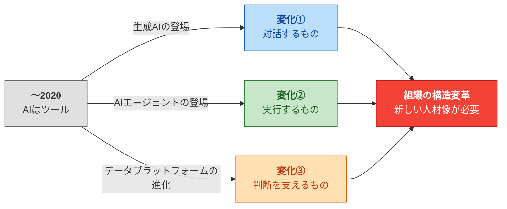

### 第一の変化：AIが「対話するもの」になった

GPT-3.5、GPT-4、Claude、Geminiの登場により、AIは自然言語で対話する存在になった。これは技術的な変化であると同時に、組織における「AIとの接点」の変化である。

従来、AIに触れるのは技術者だけだった。Pythonでモデルを呼び出し、APIを叩き、パラメータを調整する。非技術者にとってAIは「技術部門が管理するブラックボックス」だった。

生成AIは、この壁を消した。営業担当者が提案書を下書きさせ、マーケターがキャンペーンのコピーを生成し、経営企画部が市場分析のたたき台を作らせる。AIとの接点が、技術部門から全部門に拡散した。

この変化が組織に突きつける問いは明確だ。**「全員がAIを使える状態で、誰がAIの使い方の方向性を設計するのか？」**

### 第二の変化：AIが「実行するもの」になった

Claude CodeやGitHub Copilot Workspaceに代表されるAIコーディングエージェントの登場は、AIの役割を「回答する存在」から「実行する存在」に変えた。

コードを書く。テストを実行する。デプロイする。ドキュメントを生成する。これまで人間のエンジニアが数日かけていた作業を、AIエージェントが数十分で完了する。Anthropicの「Cowork」はさらに踏み込み、AIがデスクトップ環境を操作し、複数のアプリケーションを横断して業務を遂行するビジョンを提示した。

この変化は、組織のコスト構造と人員構成に直接影響する。SaaSの導入判断が変わる。開発チームの構成が変わる。外注と内製の境界が変わる。これは「技術の問題」ではなく、「経営の問題」である。

**「AIが実行できるなら、人間は何を判断すべきなのか？」** —— この問いに答えられる人材が、組織にいるだろうか。

### 第三の変化：AIが「判断を支えるもの」になった

Palantir Foundryに代表されるデータプラットフォームは、組織内のあらゆるデータを統合し、AIがリアルタイムで意思決定を支援する基盤を構築した。Palantirはこれを「オントロジー（Ontology）」と呼ぶ。組織の実体（顧客、製品、取引、拠点等）とその関係性をデジタル上に写像し、AIがその構造を理解した上で判断を補助する。

これは「データ分析」とは次元が異なる。データ分析は過去の事実を整理する。オントロジーベースのAIは、現在のオペレーションにリアルタイムで介入し、未来の判断を支援する。

サプライチェーンの異常を検知し、代替ルートを提案する。顧客の離脱リスクを予測し、介入アクションを推奨する。生産ラインの稼働率をリアルタイムで最適化する。AIが「経営の中枢」に入り始めている。

**「AIが経営判断に関与する時代に、その判断の質を誰が設計するのか？」**

## 1-3. 組織構造への影響

3つの変化を重ねると、1つの構造的帰結が見える。

| 変化 | AIの位置づけ | 組織への影響 |
|------|-------------|-------------|
| 対話するもの | 全員がAIと接する | AIの活用方針・方向性の設計が必要になる |
| 実行するもの | AIが業務を遂行する | コスト構造・人員構成・内製/外注の意思決定が変わる |
| 判断を支えるもの | AIが経営判断に関与する | 意思決定プロセスそのものの再設計が必要になる |

従来のAI——「ツール」としてのAI——は、技術部門が管理すれば事足りた。しかし、上記の3つの変化が同時に起きている現在、AIの活用は技術プロジェクトではなく、**組織全体の構造変革**になった。

構造変革には、技術を理解しながら事業戦略を設計し、実行まで推進できる人材が必要になる。

では、その人材は今、組織の中にいるのか？

次章では、既存の6つの職種を分析し、この構造変革をカバーできる人材が**誰もいない**ことを証明する。

 

# 第2章：誰もこの空白を埋めていない

## 2-1. 6つの既存職種の分析

AIに関わる人材は不足していない。AIエンジニア、データサイエンティスト、CAIOなど、AIを冠する職種は増え続けている。しかし第1章で示した構造変革——AIが組織の意思決定構造そのものを変える——に対応できる人材は、既存の職種の中に見当たらない。

以下では、AIに関連する主要な6つの職種を分析し、それぞれが「何をカバーし」「何をカバーできていないか」を明らかにする。

---

### ① AIエンジニア / MLエンジニア

**カバー領域：** AIモデルの設計・構築・最適化・実装。学習パイプラインの構築、推論の最適化、本番環境へのデプロイ。

**カバーできない領域：** 「何を作るべきか」の判断。AIエンジニアは与えられた要件に対して最適な技術的解を設計する専門家である。しかし「この事業課題に対してAIをどう活用すべきか」「そもそもAIで解くべき問題なのか」という上流の判断は、彼らの職域ではない。

AIエンジニアに「新規事業をAIで設計してほしい」と依頼するのは、建築家に「この土地にどんなビジネスを建てるべきか」を問うようなものだ。建築家は建物を設計する専門家であり、ビジネスモデルを設計する専門家ではない。

### ② データサイエンティスト

**カバー領域：** データの分析・可視化・インサイト抽出。統計的手法と機械学習を用いた予測モデルの構築。組織のデータから意味のあるパターンを発見する。

**カバーできない領域：** 発見したインサイトを「事業の設計」に変換すること。データサイエンティストは「この市場セグメントに成長の可能性がある」と示すことはできる。しかし「その可能性を、AIを前提としたどのようなビジネスモデルで実現するか」は、彼らの職域外である。

また、生成AIの出現により、データサイエンティストの従来の中核スキル（統計分析、ML）とは異なる知識領域——Scaling Laws、大規模言語モデルのアーキテクチャ、エージェント型AI——が戦略上重要になっている。これらの領域は、データサイエンスの延長線上にはない。

### ③ CAIO（Chief AI Officer）

**カバー領域：** 組織全体のAI戦略の最終意思決定。予算配分、ガバナンス、取締役会への報告。AI関連の組織横断調整。

**カバーできない領域：** AI戦略の「設計」と「実行推進」の当事者性。CAIOはC-suite（経営層）のポジションであり、その時間の多くは組織マネジメント、取締役会対応、ガバナンス整備に費やされる。

IBM の2025年調査によれば、組織の26%がCAIOを設置済みだ。しかしCAIOが「方針を決める人」であるのに対し、「その方針に基づいて、具体的な事業機会を特定し、方法論を設計し、プロトタイプを回し、成果を出す人」が不在であるケースが多い。

軍事的な比喩を使えば、CAIOは司令官である。しかし、作戦を設計し、選択肢を構造化し、実行計画を詰める参謀がいなければ、司令官は判断材料を持てない。

### ④ AIコンサルタント

**カバー領域：** 外部の専門家として、AI導入の助言を行う。ユースケースの提案、技術選定の推奨、ROI算出、導入ロードマップの策定。

**カバーできない領域：** 2つの構造的限界がある。

**第一に、実行へのコミットメントがない。** AIコンサルタントの成果物は、多くの場合レポートやスライドデッキである。「御社はこうすべきだ」という助言を納品し、実行は顧客に委ねる。しかし、AI戦略の真の難しさは「何をすべきか」を知ることではなく、「それを実際に実行し、成果を出すこと」にある。戦略と実行の間に横たわる溝を、コンサルタントは渡らない。

**第二に、ベンダー依存のバイアスがかかりやすい。** 大手コンサルティングファームは、特定のテクノロジーベンダーとパートナーシップを持つ。アクセンチュアはMicrosoftと深い提携関係にある。デロイトはAWS、Google Cloudとの協業を推進している。このパートナーシップ構造は、技術選定の客観性にバイアスをもたらす。クライアントの最適解ではなく、ファームのパートナーシップ関係が推奨に影響を与えるリスクが構造的に存在する。

### ⑤ AIプロダクトマネージャー

**カバー領域：** AI機能を持つプロダクトの企画・開発管理。ユーザーリサーチ、要件定義、開発チームとの調整、リリース管理。

**カバーできない領域：** スコープが「単一プロダクト」に閉じる。AIプロダクトマネージャーは「このプロダクトにどのAI機能を搭載するか」を考える。しかし「AIによって事業ポートフォリオ全体をどう再設計するか」「AIネイティブな新規事業をどう生み出すか」という問いは、プロダクトマネジメントのスコープを超えている。

### ⑥ DX推進担当 / ビジネスアーキテクト

**カバー領域：** 組織のデジタル化推進。業務プロセスの可視化・改善、デジタルツールの導入、変革マネジメント。経産省のデジタルスキル標準が定義する5つのDX人材類型の中で、ビジネスアーキテクトは最も上流に位置する。

**カバーできない領域：** AI固有の構造的理解が薄い。DX推進は「既存業務のデジタル化」が中心であり、AIの構造的原理——Scaling Laws、エージェント型アーキテクチャ、大規模言語モデルの能力と限界——に基づいた戦略設計は、DX推進の延長線上にはない。

「デジタル化」と「AI化」は異なる。デジタル化は既存プロセスを効率化する。AI化は、プロセスそのものを再設計し、場合によっては消滅させる。この違いを理解し、後者を設計できる人材が必要である。

---

## 2-2. 空白領域の構造

6つの職種の分析を重ねると、以下の空白が見える。

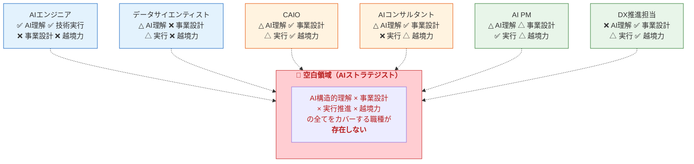

| 能力 | AIエンジニア | データサイエンティスト | CAIO | AIコンサルタント | AI PM | DX推進 |
|------|:-----------:|:-------------------:|:----:|:---------------:|:-----:|:------:|
| AIの構造的原理の深い理解 | ○ | △ | △ | △ | △ | ✕ |
| AI前提の事業設計能力 | ✕ | ✕ | ○ | ○ | △ | ○ |
| 方法論に基づく実行推進 | ○（技術実行） | △ | △ | ✕ | ○ | △ |
| 技術とビジネスの越境・翻訳 | ✕ | ✕ | ○ | △ | △ | ○ |

**4つの能力すべてに○がつく職種は、存在しない。**

AIの構造的原理を深く理解し（AIエンジニアの世界）、それを前提とした事業設計ができ（経営コンサルタントの世界）、方法論を持って実行を推進し（プロジェクトマネージャーの世界）、その全てを越境的に接続できる（翻訳者の世界）——この4つの交差点に立つ人材を定義する職種が、現時点で世界のどこにも存在しない。

---

## 2-3. 制度的にも定義されていない

この空白は、実務の現場だけでなく、制度・学術の世界でも確認できる。

### 政府機関

| 機関 | フレームワーク | AI Strategistの定義 |
|------|-------------|:-------------------:|
| 米国OPM | AI Classification Policy（2024年） | **なし**（12以上のAI職種を定義したが含まれず） |
| EU ESCO | 欧州スキル・職業分類 | **なし**（2,942職種に含まれず） |
| 日本・経産省 | デジタルスキル標準 | **なし**（5類型に含まれず、2024年生成AI対応版でも追加なし） |
| 日本・IPA | ITスキル標準 | **なし**（11職種38専門分野に含まれず） |
| WEF | Future of Jobs Report 2025 | **なし** |

### 学術・研究機関

Georgetown大学CSETが2021年に発表した最も精緻なAI人材分類（54のAI関連職種をSOCコードにマッピング）にも、AI Strategistは含まれていない。査読付き論文での正式な定義も存在しない。

### 標準化団体・認定資格

ISO、IEEE、ACM、AAIAのいずれもAI Strategistを定義していない。存在する認定は、IBQMIの「Certified AI Strategist™」（小規模オンラインプログラム）とThe Case HQの「Certified AI Business Strategist」のみ。いずれも国際的な権威性を持たない。

### コンサルティングファーム・テック企業

MBB（マッキンゼー、BCG、ベイン）、Big Four（PwC、EY、KPMG、デロイト）のいずれも正式な定義を発表していない。GAFAM、Anthropic、OpenAIも正式なAI Strategist職を設置していない。AWSの「Generative AI Strategist」が唯一に近い例だが、これはAWS固有のポジションであり、ベンダー独立性を持たない。

### ソートリーダー

類似の役職には「定義者」がいた。Chief AI Officer（CAIO）はAndrew Ngが2016年のHBR記事で定義し、市場に受け入れられた。データサイエンティストはDJ PatilとJeff Hammerbacherが初期に概念を確立した。

AI Strategistには、この「定義者」が存在しない。専門書もなく、TED Talkもなく、マニフェストもない。

---

## 2-4. Palantir FDEモデル——「外部専門家」の再定義

この空白を理解する上で、Palantirが生み出したFDE（Forward Deployed Engineer）モデルは重要な構造的参照点となる。

### FDEとは何か

FDEは2010年代初頭にPalantirが考案した職種である。従来のソフトウェア企業が「プロダクトを作って売る」のに対し、Palantirは**エンジニアを顧客の環境に直接埋め込み、現場の問題を理解し、解決策を構築し、本番環境まで持っていく**というモデルを確立した。

Palantirの公式定義は明快だ。「FDEの責任は、スタートアップのCTOに似ている。小さなチームで、ハイステークスなプロジェクトのエンドツーエンドの実行を所有する。」

2016年まで、Palantirには通常のソフトウェアエンジニアよりもFDEの方が多かった。この事実自体が、FDEモデルがPalantirの事業成功の中核であったことを示している。

### FDEが破壊したもの

FDEモデルが従来のコンサルティングと根本的に異なるのは、以下の3点である。

| 項目 | 従来のコンサルティング | Palantir FDE |
|------|-------------------|-------------|
| 成果物 | レポート・スライドデッキ | 本番環境で動くシステム |
| 測定基準 | 稼働時間・プロジェクト完了 | 顧客の事業成果 |
| 関与方法 | 外部から助言 | 顧客環境に埋め込まれて構築 |

Silicon Valley Product Groupの創設者Marty Caganは、FDEモデルの本質をこう要約している。「エンパワーメントされたエンジニアを顧客の元に直接送り込み、問題と解決策の空間を学ぶために集中的に埋め込む。それにより、必要な成果を達成する解決策を発見できるようにする。」

### FDEの構造的限界

しかし、FDEモデルには1つの構造的限界がある。**PalantirのFDEは、Palantirのプラットフォーム（Foundry、AIP、Gotham）を前提とする。** 彼らがどれほど優秀であっても、技術選定の段階で既にPalantir製品に固定されている。

顧客の課題にとって、Palantirのプラットフォームが最適解でない場合でも、FDEはPalantirを使う。なぜなら、それが彼らの存在理由だからだ。

現在、FDEモデルはPalantirを超えて拡散している。OpenAIが2025年にFDEチームを設立し、Ramp、Stripe等のスタートアップもFDEを採用している。しかしいずれの場合も、FDEは**自社のプラットフォームを顧客環境に実装する技術者**であり、ベンダーに依存しない客観的な立場ではない。

### FDEから学ぶべき原則、超えるべき限界

FDEモデルから抽出すべき原則は明確だ。

1. **成果コミット：** スライドではなく、動くものを出荷する
2. **埋め込み型：** 外部から俯瞰するのではなく、顧客の中に入る
3. **エンドツーエンド：** 課題発見から実装まで一貫して関与する

同時に、超えるべき限界も明確だ。

- **ベンダー独立性：** 特定プラットフォームに依存せず、客観的に最適な技術を選定する
- **スコープの拡張：** 技術実装だけでなく、事業戦略の設計まで射程に含める
- **方法論の抽象化：** 個別の技術スタックに閉じず、再現可能な方法論として体系化する

FDEの「成果コミット」と「埋め込み型関与」を継承し、そこに「ベンダー独立性」と「事業設計能力」を加えた存在——それが次章で定義するAIストラテジストである。

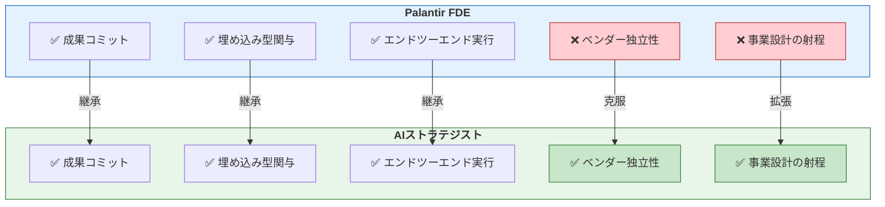

---

## 2-5. 空白の構造的証明

本章で証明したことを整理する。

**実務の空白：** 6つの既存職種のいずれも、「AIの構造的理解 × 事業設計 × 実行推進 × 越境力」の全てをカバーできていない。

**制度の空白：** 世界のいかなる政府機関、学術機関、標準化団体、コンサルティングファーム、テック企業も、この空白を埋める職種を定義していない。

**モデルの示唆：** PalantirのFDEモデルは「成果コミット × 埋め込み型関与」という原則で従来のコンサルティングを破壊したが、ベンダー独立性と事業設計の射程という限界を持つ。

空白は証明された。次章では、この空白を埋める役割——AIストラテジスト——を、3つの原則から定義する。

 

# 第3章：3つの原則

## 3-1. 原則の位置づけ

AIストラテジストの定義は、「能力」の前に「原則」から始まる。

能力（コンピテンシー）は、個人が後天的に獲得するものだ。訓練と経験によって高められる。しかし原則は、能力の前提条件として存在する。どれほど高い能力を持っていても、原則を満たさなければ、AIストラテジストとしては機能しない。

本章では、AIストラテジストを定義する3つの原則を論じる。

| # | 原則 | 本質 |
|---|------|------|
| 1 | ベンダー独立性（Vendor Independence） | 構造的に客観であること |
| 2 | 成果コミット（Outcome Commitment） | 助言ではなく成果を出荷すること |
| 3 | 埋め込み型関与（Embedded Engagement） | 外から見るのではなく中に入ること |

---

## 3-2. 原則1：ベンダー独立性（Vendor Independence）

### なぜこれが原則なのか

AI市場は、ベンダーの利害が複雑に絡み合う領域である。

AWSの「Generative AI Strategist」はAWSのサービスを前提とする。MicrosoftのAIアドバイザーはAzure OpenAIを推奨する。PalantirのFDEはFoundryを実装する。Google CloudのAIコンサルタントはVertex AIを提案する。彼らは全員、優秀な専門家だ。しかし、技術選定の段階で既にバイアスがかかっている。

これは能力の問題ではない。**構造の問題**である。AWSに所属する人間がどれほど公平であろうとしても、AWSのサービスを推薦するインセンティブが構造的に存在する。その人間の能力や倫理に関係なく、所属という構造がバイアスを生む。

AI技術の選択肢は爆発的に増えている。基盤モデルだけでも、OpenAI、Anthropic、Google、Meta（Llama）、Mistral、各種オープンソースモデルが競合する。しかもその優位性は数ヶ月単位で入れ替わる。2024年に最適だった技術スタックが、2025年には最適でない可能性がある。この流動性の中で、特定ベンダーに紐づいた専門家は、客観的な技術選定を構造的に担保できない。

### 歴史的先行事例

この問題は、AI固有のものではない。IT業界では数十年前から議論されてきた。

1990年代〜2000年代、日本のITコンサルティング市場では、SIer（システムインテグレーター）がコンサルティングと実装を兼ねることで、特定のハードウェア・ソフトウェアベンダーの製品が「推薦」される構造が常態化していた。この中で、フューチャーアーキテクト（現フューチャー株式会社）は「ITコンサルタントとして特定のベンダーに依存しない」ことを明示的に価値として掲げ、クライアントに対してフラットな技術選定を行う独立性を差別化要因とした。

AI時代には、この独立性の重要度がさらに増す。理由は3つある。

**第一に、技術の変化速度が速い。** ERPやデータベースの選定は、一度決めれば5〜10年は使う。しかしAIの基盤モデルやフレームワークは、半年で勢力図が変わる。特定ベンダーにロックインされるリスクは、従来のIT投資の比ではない。

**第二に、AIの適用領域が広い。** 従来のITシステムは業務プロセスの自動化が中心だった。AIは業務プロセスだけでなく、製品開発、顧客体験、意思決定プロセス、さらには事業モデルそのものに影響する。誤った技術選定の影響範囲が、格段に大きい。

**第三に、ベンダーの営業力が強い。** OpenAI、Google、Microsoft、AWSは、いずれも強力な営業組織を持ち、大企業に対してAIプラットフォームの採用を積極的に推進している。独立した視点を持たない組織は、ベンダーの営業力に流される。

### ベンダー独立性の定義

ベンダー独立性とは、以下の条件を満たすことである。

- 特定のAIベンダー・プラットフォーム企業に雇用されていない、または収益を依存していない
- 技術選定において、クライアントの課題と制約条件のみに基づいて判断する
- 必要に応じて、複数のベンダー技術を組み合わせた最適解を設計できる
- 技術の変化に応じて、推奨を柔軟に更新できる

これは「すべてのベンダー技術に精通している」ことを意味しない。すべてのモデルのベンチマークを暗記している必要はない。重要なのは、**評価の構造が特定ベンダーに偏っていないこと**——構造的独立性である。

---

## 3-3. 原則2：成果コミット（Outcome Commitment）

### 「助言」と「成果」の間の溝

AIコンサルティングの市場には、構造的な欠陥がある。

コンサルタントの成果物は「レポート」や「ロードマップ」である。「御社はこのAI技術を導入すべきだ」「このユースケースから始めるべきだ」「ROIはこの水準になる見込みだ」——こうした助言が、美しくフォーマットされたスライドデッキとして納品される。

しかし、クライアントが本当に必要としているのは、スライドではない。**動くプロトタイプ**であり、**検証された仮説**であり、**実行可能な事業計画**であり、最終的には**事業成果**である。

助言と成果の間には、深い溝がある。「何をすべきか」を知ることと、「それを実際に成果として実現すること」は、まったく異なるスキルと関与を必要とする。多くのAI戦略プロジェクトが失敗するのは、戦略が間違っていたからではなく、**戦略と実行の間の溝を渡る人間がいなかったから**である。

### PalantirのFDEが証明したこと

第2章で論じたPalantirのFDEモデルは、この溝を埋めた。

FDEの測定基準は「稼働時間」でも「プロジェクト完了」でもない。**顧客の事業成果**である。サプライチェーンの最適化によるコスト削減。意思決定のスピード向上。オペレーションの効率化。FDEは「スライドデッキではなくコードを出荷する（ship code, not slide decks）」と評される。

この原則は、技術領域に限定されない。AIストラテジストは、FDEと同じ原則で事業戦略の領域に関与する。

| 項目 | AIコンサルタント | AIストラテジスト |
|------|:---------------:|:---------------:|
| 成果物 | レポート・ロードマップ | 動くプロトタイプ・検証された仮説・事業成果 |
| 測定基準 | 稼働時間・納品完了 | 事業インパクト |
| 関与の終点 | 助言の納品 | 成果の実現 |
| 実行への責任 | クライアントに委ねる | 自ら推進する |

### 成果コミットの定義

成果コミットとは、以下の条件を満たすことである。

- 助言の提供ではなく、事業成果の実現を自らの責任として引き受ける
- 成果物は文書ではなく、動くプロトタイプ、検証された仮説、または実装された仕組みである
- 成果が出なかった場合、その原因を分析し、方法論を改善するフィードバックループを持つ
- 再現可能な方法論に基づいて実行し、属人的な勘に依存しない

最後の条件が特に重要だ。成果コミットが「個人の能力」に依存していれば、スケールしない。AIストラテジストが成果にコミットできるのは、**再現可能な方法論**を持っているからである。方法論があるからこそ、異なる業界、異なる組織、異なる課題に対しても、一定の品質で成果を追求できる。

---

## 3-4. 原則3：埋め込み型関与（Embedded Engagement）

### なぜ「外から見る」では足りないのか

AIの活用における最大の障壁は、技術ではない。**コンテクスト**——組織固有の文脈、業務の実態、意思決定の力学、データの現実——の理解である。

外部から組織を観察しても、コンテクストは十分に理解できない。公開情報、ヒアリング、データ分析では見えないものがある。現場の営業担当者が毎朝30分かけている「非公式な情報共有」。経営会議で発言力を持つ人物と、形式的な意思決定者が異なるという力学。基幹システムのデータが「公式には正確」だが「現場では信用されていない」という現実。

こうしたコンテクストは、**組織の中に入らなければ見えない**。

PalantirのFDEが成功した理由の一つは、まさにこの点にある。FDEは顧客のオフィスに常駐し、現場のオペレーターと並んで座り、実際のデータに触れ、実際のワークフローを体験する。だから、会議室のプレゼンテーションでは発見できない課題と機会を見つけられる。

### 埋め込みの深度

埋め込み型関与には、深度のグラデーションがある。

| 深度 | 関与の形態 | 期間 | 主な活動 |
|------|-----------|------|---------|
| Level 1 | 定期訪問 | 月1〜2回 | 戦略レビュー、技術トレンド解釈、重要意思決定の支援 |
| Level 2 | 週次関与 | 週2〜3日 | 事業機会の特定、プロトタイプ設計、ステークホルダーとの協働 |
| Level 3 | 常駐型 | フルタイム | 事業設計から検証、実装、組織能力の移転まで一貫して推進 |

AIストラテジストの配置パターン（第6章で詳述）に応じて、適切な深度は異なる。しかし、いずれの深度においても、**組織の内側に入り、コンテクストを直接理解する**という原則は共通する。外部からの助言のみで完結する関与は、AIストラテジストの定義に含まれない。

### 埋め込み型関与の定義

埋め込み型関与とは、以下の条件を満たすことである。

- 組織の内部に入り、現場のオペレーション、データ、意思決定プロセスを直接理解する
- 外部からの観察やヒアリングだけでなく、組織のメンバーと協働して課題を発見する
- 発見した課題に対して、その組織のコンテクストに即した解決策を設計する
- 一方的な知識の注入ではなく、組織との双方向の学習プロセスを通じて価値を生む

---

## 3-5. 3原則の相互依存

3つの原則は、独立して存在するのではなく、相互に依存している。

**ベンダー独立性がなければ、成果コミットは歪む。** 特定ベンダーに依存した状態では、「クライアントにとっての最適解」ではなく「自社にとっての最適解」にコミットしてしまう。Palantir FDEの成果コミットが強力であるにもかかわらず、構造的限界を持つのはこの点にある。

**埋め込み型関与がなければ、成果コミットは空回りする。** 組織のコンテクストを理解せずに成果にコミットしても、表面的な成果——「AIを導入した」というチェックボックス——に終わる。真の成果は、組織の現実に即した設計と実行からしか生まれない。

**成果コミットがなければ、埋め込み型関与は「高額な見学」になる。** 組織に入り込んでも、成果を出す意志と方法論がなければ、ただの傍観者である。埋め込みの価値は、成果コミットと結合して初めて発揮される。

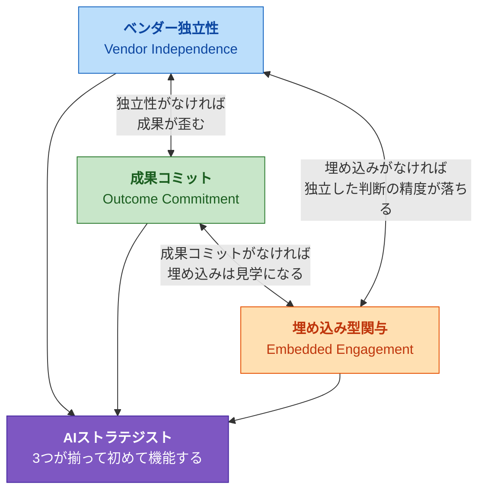

---

## 3-6. 原則の充足による既存職種の再評価

3つの原則を評価軸として、既存職種を再評価する。

| 職種 | ベンダー独立性 | 成果コミット | 埋め込み型関与 | 3原則の充足 |
|------|:-----------:|:-----------:|:------------:|:-----------:|
| **AIストラテジスト** | **○** | **○** | **○** | **3/3** |
| CAIO | ○ | ○ | ○（社内常駐） | 3/3 ※ |
| Palantir FDE | ✕ | ○ | ○ | 2/3 |
| AIコンサルタント | △ | ✕ | ✕ | 0〜1/3 |
| AIエンジニア | ✕ | ○ | ○ | 2/3 |
| データサイエンティスト | △ | △ | ○ | 1〜2/3 |
| AI PM | ✕ | ○ | ○ | 2/3 |
| DX推進担当 | ○ | △ | ○ | 2〜3/3 |

**※ CAIOに関する注記：** CAIOは3原則を形式的に満たすが、C-suite（経営層）のポジションであり、AI戦略の「設計」と「実行推進」の当事者性に制約がある。また、社内の一組織に固定されるため、複数組織を横断する視点を持ちにくい。AIストラテジストとCAIOの関係は、第6章で詳述する。

3つの原則を定義した。次章では、これらの原則の上に立つコンピテンシー——AIストラテジストに求められる具体的な能力——を設計する。

 

# 第4章：コンピテンシーモデル

## 4-1. 設計の方法論

本章で定義するコンピテンシーモデルは、帰納的に設計されたものではない。

「AIストラテジストとして成功している人物の特徴を集めて抽象化した」のではなく、第2章で証明した空白領域と、第3章で定義した3つの原則から、**演繹的に導出した**ものである。

空白領域：「AIの構造的理解 × 事業設計 × 実行推進 × 越境力」の全てをカバーできる職種が存在しない。

3つの原則：ベンダー独立性、成果コミット、埋め込み型関与。

この空白を埋め、3つの原則の上で機能するために、**論理的に何が必要か**を逆算する。それがコンピテンシーモデルの設計方法である。

---

## 4-2. 全体構造：3層 + 基盤

コンピテンシーモデルは、3つの能力レイヤーと1つの基盤層で構成される。

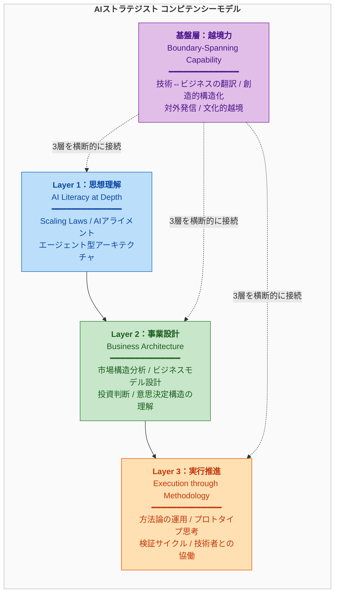

3つのレイヤーは上下の階層関係ではない。Layer 1がLayer 2の前提であり、Layer 2がLayer 3の前提である、という意味での「積層構造」だ。思想を理解しなければ事業を設計できず、事業を設計しなければ実行を推進できない。そして基盤層は、3つのレイヤーを横断し、接続する能力である。

---

## 4-3. Layer 1：思想理解（AI Literacy at Depth）

### なぜ「使い方」ではなく「思想」なのか

市場にはAIの「使い方」を教える研修やコンテンツが溢れている。プロンプトエンジニアリング、AIツールの操作方法、業務へのAI活用事例。これらは有用だが、AIストラテジストに求められるのは「使い方」ではない。**「なぜAIはこのように進化しているのか」「その進化の先に何があるのか」「何が可能で何が不可能なのか」を構造的に理解すること**である。

具体例を挙げる。

経営者から「うちの会社にもAIを導入したい」と相談された場合、AIの使い方を知っている人間は「ChatGPTを業務に使いましょう」と答える。AIの構造を理解している人間は、以下のように考える。

- この企業のデータ資産は何か。AIが価値を発揮するのは、独自のデータを持つ領域である
- 事業のどの部分がAIエージェントによって自動化可能か。自動化すべきかどうかの判断はどうするか
- 現在のAIモデルの能力の限界はどこにあり、6ヶ月後、1年後にその限界はどう変わる可能性があるか
- この企業の業界特有の規制やガバナンス要件は何か。それはAI活用にどう影響するか

この思考の深度の差が、「AIツールの導入支援」と「AI起点の事業変革の設計」の差である。

### 思想理解の具体的領域

| 領域 | 内容 | なぜ必要か |
|------|------|-----------|
| Scaling Laws | モデルの規模・データ量・計算量と性能の関係。べき乗則の構造 | AI投資の判断根拠。「次世代モデルは何ができるようになるか」の予測に必要 |
| AIアライメントと安全性 | Constitutional AI、RLHF、モデルの制御可能性 | 企業がAIを導入する際のリスク評価、ガバナンス設計に不可欠 |
| エージェント型アーキテクチャ | 自律的に行動するAIの設計パターン。ツール使用、計画立案、メモリ | 業務プロセスの再設計、人間とAIの役割分担の設計に必要 |
| マルチモーダル・基盤モデル | テキスト、画像、音声、動画を統合的に扱うモデルの能力と限界 | ユースケースの適切な評価。過大評価も過小評価も避けるために必要 |
| オープンソース vs プロプライエタリ | Llama、Mistral等のオープンモデルと、GPT、Claudeの構造的な違い | ベンダー独立な技術選定の前提知識 |

### 思想理解の深度

AIストラテジストは研究者ではない。Transformerの数式を導出したり、学習アルゴリズムの新しいバリエーションを考案したりする必要はない。

求められるのは「構造的理解」——AIの進化がなぜこの方向に進んでいるのかの原理を理解し、そこから事業戦略上の含意を導出できるレベルの理解——である。

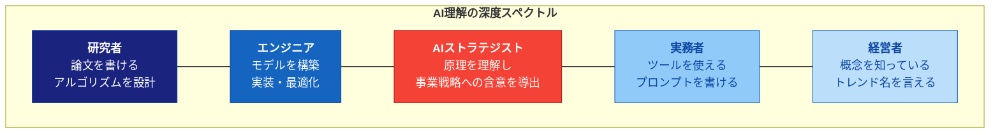

AIストラテジストの位置は、エンジニアと実務者の間だ。自らモデルを構築する必要はないが、「なぜこのモデルがこの用途に適しているか」を構造的に説明できる水準が求められる。

---

## 4-4. Layer 2：事業設計（Business Architecture）

### AIを「導入」するのではなく「前提」にする

多くの企業がAIを「既存業務に導入する」という発想で取り組んでいる。既存のプロセスがあり、その一部をAIで効率化する。この発想は間違いではないが、AIストラテジストの射程はここに留まらない。

AIストラテジストが設計するのは、**AIを前提とした事業そのもの**である。

| アプローチ | 問い | 成果物 |
|-----------|------|--------|
| AI導入 | 「既存業務のどこにAIを使えるか？」 | 効率化されたプロセス |
| AI前提の事業設計 | 「AIが前提にある世界で、どんな事業が成立するか？」 | 新しいビジネスモデル、新しい顧客価値 |

例えば、保険業界を考える。「AI導入」アプローチは、査定プロセスの自動化、コールセンターの効率化などを指す。「AI前提の事業設計」アプローチは、リアルタイムのリスク評価に基づく動的な保険料設定、AIエージェントが顧客のライフイベントを予測して最適なプランを自動提案するサービスモデルなど、**事業の構造そのもの**を再設計する。

### 事業設計の具体的能力

| 能力 | 内容 |
|------|------|
| 市場構造分析 | どの産業の、どのバリューチェーンが、AIによって構造変化するかを特定する |
| ビジネスモデル設計 | AI前提のコスト構造、収益モデル、競争優位を設計する。SaaS、プラットフォーム、FDE型サービスなど、モデルの選択肢を構造的に評価できる |
| ユースケース評価 | AI技術の現在の能力と限界に基づいて、実現可能性・事業インパクト・実装難易度を三軸で評価する |
| 投資判断の設計 | AI投資のROI算出方法を設計する。AI投資は従来のIT投資と異なり、効果が非線形（データが溜まるほど価値が上がる等）であるため、従来のROIモデルが適用できないケースが多い |
| 組織の意思決定構造の理解 | 経営層がどう判断するか、何が承認のゲートになるか、誰がキーパーソンかを理解し、提案を通すための構造を設計できる |

### Layer 1との接続

Layer 1（思想理解）がなければ、Layer 2（事業設計）は空虚になる。

AI技術の構造的原理を理解していなければ、「この事業にAIを適用した場合、何が実現可能で何が不可能か」の判断が甘くなる。過大なビジョンを描いて挫折するか、過小な活用に留まって機会を逃す。

Layer 1が「AIの世界で何が起きているか」を理解する能力なら、Layer 2は「それを事業の世界に翻訳し、構造化する」能力である。

---

## 4-5. Layer 3：実行推進（Execution through Methodology）

### なぜ「方法論」が必要なのか

第3章の原則2（成果コミット）で述べた通り、AIストラテジストは助言ではなく成果を出荷する。しかし、成果コミットは「意志」だけでは実現しない。**再現可能な方法論**が必要である。

方法論がなければ、成果は属人的になる。ある組織では成功し、別の組織では失敗する。理由を説明できない。改善できない。スケールしない。

方法論があれば、以下が可能になる。

- 異なる業界、異なる規模、異なる成熟度の組織に対して、一定の品質で価値を提供できる
- 失敗した場合、方法論のどのステップに問題があったかを特定し、改善できる
- 方法論自体を進化させることで、AIストラテジストとしての能力が継続的に向上する
- 方法論を他者に教えることで、組織の能力移転が可能になる

### 実行推進の具体的能力

| 能力 | 内容 |
|------|------|
| 方法論の保有と運用 | 属人的な勘ではなく、構造化されたプロセスで事業開発を推進する。仮説構築→プロトタイプ→検証→学習のサイクルを回す |
| プロトタイプ思考 | 完璧な計画を立ててから実行するのではなく、最小限の動くものを最速で作り、市場や組織の反応から学ぶ |
| 検証サイクルの設計 | 何を、どの順番で、どの粒度で検証するかを設計する。検証の失敗も含めて学習として構造化する |
| 技術者との協働 | 自らコードを書く必要はないが、技術者と同じ言語で対話し、技術的制約を理解し、方向性を共有できる |

### 「コードを書ける」は要件ではない

ここで明確にしておくべきことがある。**AIストラテジストの定義に「コードを書ける」は含まれない。**

PalantirのFDEはエンジニアであり、コードを書くことが前提だ。しかしAIストラテジストは「Forward Deployed Strategist」であり、成果物はコードではなく事業成果である。

ただし、2つの能力は求められる。

**第一に、技術者と「同じ言語で」対話できること。** APIの概念を理解し、データパイプラインの構造を図で描け、モデルの推論速度とコストのトレードオフを議論できる。コードを書けなくても、技術的な会話に参加できる水準。

**第二に、プロトタイプを動かせること。** 生成AI時代では、ノーコードツールやバイブコーディング（自然言語でAIにコードを書かせる手法）により、非エンジニアでもプロトタイプレベルのアプリケーションを構築できるようになっている。この能力は、検証サイクルを高速に回すために有用であり、成果コミットの原則を実行レベルで支える。

---

## 4-6. 基盤層：越境力（Boundary-Spanning Capability）

### なぜ「基盤」なのか

3つのレイヤーは、それぞれ異なる世界に属している。

- Layer 1（思想理解）は**技術の世界**に属する。AIの研究者やエンジニアが主に活動する領域
- Layer 2（事業設計）は**ビジネスの世界**に属する。経営者やコンサルタントが主に活動する領域
- Layer 3（実行推進）は**実行の世界**に属する。プロジェクトマネージャーや事業開発担当が主に活動する領域

これら3つの世界は、異なる言語を話し、異なる成功指標を持ち、異なる時間軸で考える。技術者は「精度」を語り、経営者は「ROI」を語り、事業開発は「スピード」を語る。

AIストラテジストの固有性は、**この3つの世界を一人の中で接続できること**にある。Layer 1〜3を個別に持っている人間は存在し得る。しかし、3つの世界を状況に応じて切り替え、互いに翻訳し、統合的な判断を下せる人間は稀少である。

この「接続」を可能にする能力が、基盤層の越境力である。

### 越境力の具体的能力

| 能力 | 内容 |
|------|------|
| 技術⇔ビジネスの翻訳 | エンジニアにはビジネスの文脈で語り、経営者には技術の本質で語る。同じ事象を、相手の世界の言語で再構成できる |
| 創造的構造化 | 複雑な情報を、誰にでも伝わる構造とストーリーに変換する。図表、フレームワーク、比喩を駆使して、抽象的な概念を具体的に伝える |
| 対外発信と知の体系化 | 自らの方法論や知見を言語化し、書籍・OSS・講演等を通じて社外に発信できる。これにより、AIストラテジストとしての信頼性と影響力を構築する |
| 文化的越境 | グローバルなAI技術トレンドと、ローカルな市場・組織文化の両方を理解し、橋渡しできる |

### 越境力がなぜ「基盤」であり「レイヤー」ではないのか

越境力は、Layer 1〜3と同列ではない。Layer 1〜3は「何ができるか」を定義するが、越境力は「Layer 1〜3をどう接続するか」を定義する。

AIの思想を理解していても（Layer 1）、それをビジネスの文脈に翻訳できなければ、経営者に伝わらない。事業を設計できても（Layer 2）、それを技術者が実装可能な形に分解できなければ、実行に移せない。方法論を持っていても（Layer 3）、組織の各層に方法論の意義を伝え、巻き込めなければ、動かない。

越境力は、3つのレイヤーを「使える」状態にする基盤である。

---

## 4-7. コンピテンシーモデルの全体像

| レイヤー | 名称 | 核心的な問い | 対応する世界 |
|---------|------|------------|------------|
| Layer 1 | 思想理解 | AIはなぜこう進化しているのか？ | 技術の世界 |
| Layer 2 | 事業設計 | AIで事業をどう再設計するか？ | ビジネスの世界 |
| Layer 3 | 実行推進 | それをどう実現するか？ | 実行の世界 |
| 基盤層 | 越境力 | 3つの世界をどう接続するか？ | 全てを横断 |

### 3原則との接続

コンピテンシーモデルは、第3章の3原則と以下のように接続する。

| 原則 | 最も関連するレイヤー | 関係 |
|------|:------------------:|------|
| ベンダー独立性 | Layer 1 | AI技術の構造的理解があるからこそ、特定ベンダーに依存せず客観的な評価ができる |
| 成果コミット | Layer 3 | 再現可能な方法論を持っているからこそ、成果にコミットできる |
| 埋め込み型関与 | Layer 2 + 基盤層 | 事業設計能力と越境力があるからこそ、組織に埋め込まれて価値を発揮できる |

原則は「条件」であり、コンピテンシーは「能力」である。原則が「AIストラテジストが立つべき場所」を定め、コンピテンシーが「その場所で何ができるか」を定義する。

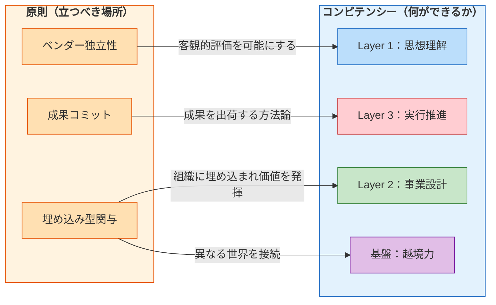

次章では、この原則とコンピテンシーの枠組みを使って、隣接する全職種との差別化を構造的に証明する。

 

# 第5章：隣接職種との差別化

## 5-1. 差別化の方法

「AIストラテジストは他の職種とどう違うのか？」

この問いに対して、曖昧な言葉で答えるのではなく、第3章の3原則と第4章のコンピテンシーモデルを評価軸として、**構造的に証明する**のが本章の目的である。

---

## 5-2. 原則の充足マトリクス

3つの原則——ベンダー独立性、成果コミット、埋め込み型関与——に対する各職種の充足度を評価する。

| 職種 | ベンダー独立性 | 成果コミット | 埋め込み型関与 | 充足数 |
|------|:-----------:|:-----------:|:------------:|:-----:|
| **AIストラテジスト** | **○** | **○** | **○** | **3/3** |
| CAIO | ○ | ○ | ○ | 3/3 ※ |
| Palantir FDE | ✕ | ○ | ○ | 2/3 |
| AIコンサルタント | △ | ✕ | ✕ | 0〜1/3 |
| AIエンジニア | ✕ | ○ | ○ | 2/3 |
| データサイエンティスト | △ | △ | ○ | 1〜2/3 |
| AIプロダクトマネージャー | ✕ | ○ | ○ | 2/3 |
| DX推進担当 | ○ | △ | ○ | 2〜3/3 |

**評価基準の説明：**

- **○：** 構造的に充足している
- **△：** 条件付きで部分的に充足、または個人の努力で充足できるが構造的には保証されない
- **✕：** 構造的に充足していない（個人の能力に関係なく、役割の構造が制約する）

### 各職種の評価根拠

**CAIO（※注記付き）：** 3原則を形式的に満たすが、2つの構造的制約がある。第一に、C-suiteポジションであるため、戦略の「設計」と「実行推進」に割ける時間が限られる（組織マネジメント、取締役会対応、ガバナンス整備に時間を取られる）。第二に、一つの組織に固定されるため、複数組織を横断する視点を獲得しにくい。

**Palantir FDE：** 成果コミットと埋め込み型関与は最高水準。しかしPalantirのプラットフォームを前提とするため、ベンダー独立性を構造的に持たない。

**AIコンサルタント：** ベンダー独立性は「ファームのパートナーシップ構造による」ため△。成果コミットは「レポート納品が主な成果物」であるため✕。埋め込み型関与は「プロジェクト期間限定の外部関与」であるため✕。

**AIエンジニア：** 所属組織の技術スタックを前提とするため、ベンダー独立性は✕。技術的な成果物（動くシステム）へのコミットは○。開発チーム内に常駐するため、埋め込み型は○。

---

## 5-3. コンピテンシーの充足マトリクス

4つのコンピテンシー——思想理解（L1）、事業設計（L2）、実行推進（L3）、越境力（基盤）——に対する各職種の充足度を評価する。

| 職種 | L1：思想理解 | L2：事業設計 | L3：実行推進 | 基盤：越境力 | 充足数 |
|------|:-----------:|:-----------:|:-----------:|:----------:|:-----:|
| **AIストラテジスト** | **○** | **○** | **○** | **○** | **4/4** |
| CAIO | △ | ○ | △ | ○ | 2〜4/4 |
| Palantir FDE | ○ | △ | ○ | △ | 2〜4/4 |
| AIコンサルタント | △ | ○ | ✕ | △ | 1〜3/4 |
| AIエンジニア | ○ | ✕ | ○ | ✕ | 2/4 |
| データサイエンティスト | △ | ✕ | △ | ✕ | 0〜2/4 |
| AIプロダクトマネージャー | △ | △ | ○ | △ | 1〜3/4 |
| DX推進担当 | ✕ | ○ | △ | ○ | 2〜3/4 |

### 各職種の評価根拠

**CAIO：** L1は「経営視点でのAI理解が中心で、技術の構造的深度にばらつきがある」ため△。L2は○。L3は「実行は部下に委任する構造」のため△。基盤層の越境力は、C-suiteとして本質的に求められるため○。

**Palantir FDE：** L1は○（Palantirは技術的に非常に高い水準を要求する）。L2は「事業設計は職域外」のため△。L3は○（FDEの最大の強み）。基盤層は「技術⇔ビジネスの翻訳はするが、事業設計まで踏み込まない」ため△。

**AIコンサルタント：** L1は「フレームワーク知識が中心で、構造的原理の深度が浅い傾向」のため△。L2は○（コンサルタントの中核能力）。L3は✕（レポート納品後の実行にコミットしない）。基盤層は「ファームの知識体系に基づく翻訳力はあるが、個人としての対外発信・知の体系化は限定的」のため△。

**AIエンジニア：** L1は○（技術的理解は最も深い）。L2は✕（事業設計は職域外）。L3は○（技術実行は最も強い）。基盤層は✕（技術の世界に閉じる傾向が強い）。

**DX推進担当：** L1は✕（AI固有の構造的理解が薄い）。L2は○（ビジネスアーキテクトとしての事業設計力）。L3は「推進はするが、AI固有の方法論を持たない」ため△。基盤層は○（組織横断の翻訳は本質的な職務）。

---

## 5-4. 2つのマトリクスの統合

原則の充足（3項目）とコンピテンシーの充足（4項目）を統合すると、**合計7項目**での評価となる。

| 職種 | 原則（/3） | コンピテンシー（/4） | 合計（/7） |
|------|:--------:|:-----------------:|:--------:|
| **AIストラテジスト** | **3** | **4** | **7** |
| CAIO | 3 ※ | 2〜4 | 5〜7 ※ |
| Palantir FDE | 2 | 2〜4 | 4〜6 |
| DX推進担当 | 2〜3 | 2〜3 | 4〜6 |
| AIプロダクトマネージャー | 2 | 1〜3 | 3〜5 |
| AIエンジニア | 2 | 2 | 4 |
| データサイエンティスト | 1〜2 | 0〜2 | 1〜4 |
| AIコンサルタント | 0〜1 | 1〜3 | 1〜4 |

### この表が証明していること

**7項目すべてに○がつく職種は、AIストラテジスト以外に存在しない。**

CAIOが最も近いが、第3章で注記した通り、C-suiteの構造的制約（時間配分、単一組織への固定）がある。Palantir FDEは成果コミットと埋め込み型、技術理解と実行推進では最高水準だが、ベンダー独立性と事業設計が構造的限界となる。

---

## 5-5. 重要な注記：「上位」ではなく「交差」

このマトリクスは、**AIストラテジストが他の職種より「偉い」ことを主張するものではない。**

各職種には、AIストラテジストを凌駕する専門性がある。

| 職種 | AIストラテジストを超える強み |
|------|--------------------------|
| AIエンジニア | 技術実装の深度。モデルの設計・最適化はAIストラテジストにはできない |
| CAIO | 組織的権限。予算配分、ガバナンス、取締役会への報告はAIストラテジストの職域外 |
| Palantir FDE | 実装の速度とシステム構築力。本番環境で動くシステムを自ら構築する能力 |
| データサイエンティスト | データ分析の精緻さ。統計的手法の深い専門知識 |
| AIコンサルタント | 多業界の知見の蓄積。ファームの知識体系を通じた広範な事例アクセス |
| DX推進担当 | 組織変革の経験。大規模な変革マネジメントの実践知 |

AIストラテジストの固有性は、「深さ」ではなく**「幅の交差」**にある。3つの原則と4つのコンピテンシーレイヤーが一人の中で交差すること——それ自体がこの職種の定義であり、他のいかなる職種にも還元できない。

各職種が「I字型人材」（一つの領域を深く掘る）だとすれば、AIストラテジストは「T字型」をさらに拡張した「π字型」あるいは「BTC型」の人材であり、複数の専門領域を横断的に接続することに本質がある。

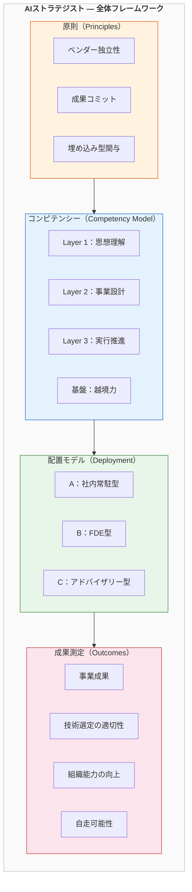

---

## 5-6. 補完関係の設計

差別化は、競合関係の証明ではない。**補完関係の設計**こそが、実務上重要である。

| AIストラテジストと… | 関係 | 協働のパターン |
|:------------------:|:----:|-------------|
| CAIO | 戦略の設計パートナー | CAIOが方針を決定し、AIストラテジストが設計と実行を推進する |
| AIエンジニア | 方向性の設定と翻訳 | AIストラテジストが「なぜ」と「何を」を設計し、エンジニアが「どうやって」を実装する |
| データサイエンティスト | インサイトの事業化 | データサイエンティストが発見し、AIストラテジストが事業に変換する |
| AIコンサルタント | 初期診断と実行の分担 | コンサルタントが現状分析と選択肢を提示し、AIストラテジストが選択と実行を推進する |
| DX推進担当 | スコープの補完 | DX推進がデジタル化の基盤を整備し、AIストラテジストがAI固有の事業変革を設計する |

AIストラテジストは、これらの職種を置き換えるのではない。**各職種の間に存在する空白を埋め、接続し、統合された価値として組織に提供する**存在である。

この補完関係が実務でどう機能するかは、次章（第6章：組織における配置と機能）で具体的に設計する。

 

# 第6章：組織における配置と機能

## 6-1. AIストラテジストは「どこにいるか」

AIストラテジストの定義は、特定の組織形態に限定されない。社内人材としても、外部の専門家としても機能し得る。本章では、3つの配置パターンと、各ステークホルダーとの関係設計を具体的に示す。

---

## 6-2. 3つの配置パターン

### パターンA：社内常駐型（Internal）

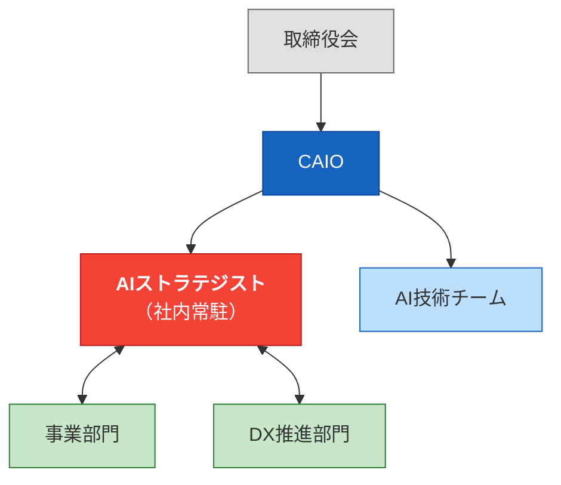

**概要：** AIを事業の中核に据える企業が、フルタイムのAIストラテジストを社内に置くケース。

**典型的な配置：** CAIOの直下。または、CAIOと並列で事業開発部門に配置。

**強み：**
- 組織のコンテクストへの理解が最も深い（日常的に社内情報に接する）
- 長期的な戦略設計に向いている（短期プロジェクトではなく、継続的な事業変革を推進）
- 社内の人間関係・力学を熟知した上で動ける

**制約：**
- 一社に閉じることで視野が狭まるリスク
- 組織の政治に巻き込まれ、客観性を維持しにくい場合がある
- ベンダー独立性が、社内の既存技術投資やベンダー関係に制約される可能性

**適する組織：** AI投資を全社戦略の中核に据えている大企業。AI関連の事業開発を恒常的に行っている組織。

---

### パターンB：FDE型（Embedded External）

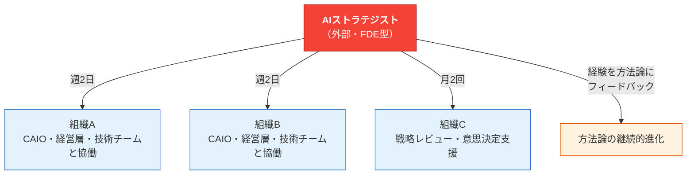

**概要：** 外部の専門家として、クライアント組織に埋め込まれて関与するケース。PalantirのFDE（Forward Deployed Engineer）モデルを、ビジネス戦略領域に適用した形態。

**典型的な契約：** 週2〜3日の関与。成果ベースの契約（プロトタイプ完成、検証結果レポート、事業化判断等のマイルストーンに紐づく）。

**強み：**
- ベンダー独立性が構造的に担保される（特定企業に雇用されていない）
- 複数組織を並行して持つことで、業界横断的なパターン認識が蓄積される
- 組織の政治から距離を置けるため、客観的な提言がしやすい
- PalantirのFDEが複数クライアントの経験をプラットフォームにフィードバックしたように、AIストラテジストは複数組織の経験を方法論にフィードバックし、方法論を継続的に進化させられる

**制約：**
- 組織のコンテクスト理解に時間がかかる（常駐型より深度が浅い初期段階がある）
- 複数クライアントの管理が必要で、時間配分のマネジメントが求められる
- 機密情報の取り扱いに関する信頼構築が必要

**適する組織：** AI戦略の必要性を感じているが、フルタイムのAIストラテジストを雇用する段階にない組織。特定のAIプロジェクト（新規事業探索、AI活用戦略の策定等）を推進したい中〜大企業。

---

### パターンC：アドバイザリー型（Strategic Advisory）

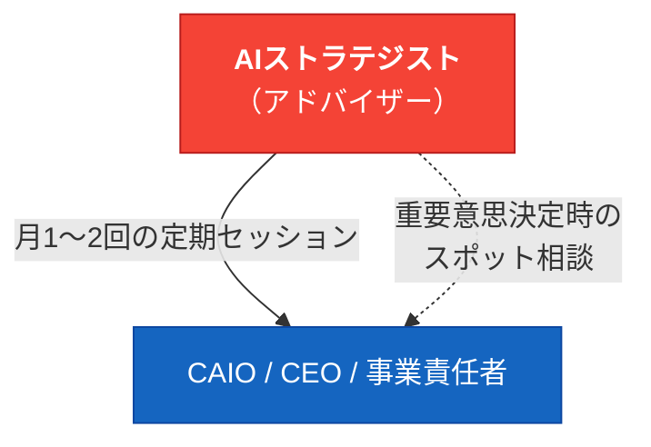

**概要：** 経営層やCAIOに対して、定期的な戦略助言を行うケース。

**典型的な関与：** 月1〜2回の定期セッション。加えて、重要な技術選定や事業判断のタイミングでスポット相談。

**強み：**
- 複数の業界・組織を俯瞰する「鳥の目」の視点を提供できる
- 経営層の意思決定に直接影響を与えられる
- 関与のコストが低く、多くの組織にアクセス可能

**制約：**
- 埋め込み型関与の深度が最も浅い。第3章の原則3を最低限しか満たさない
- 成果コミットの度合いが限定的（助言はするが、実行推進は行わない）
- 組織のコンテクスト理解が表面的になりやすい

**適する組織：** 既にAI戦略を推進する内部体制があり、外部の視点として「セカンドオピニオン」を求めている組織。AIストラテジストのキャリア後期で、複数組織に広く影響を与えるフェーズ。

---

### 3パターンの比較

| 項目 | A：社内常駐型 | B：FDE型 | C：アドバイザリー型 |
|------|:-----------:|:-------:|:-----------------:|
| ベンダー独立性 | △ | ○ | ○ |
| 成果コミット | ○ | ○ | △ |
| 埋め込み型関与 | ○（最深） | ○ | △（最浅） |
| コンテクスト理解 | 最深 | 中〜深 | 浅〜中 |
| 横断的視点 | 弱 | 強 | 最強 |
| コスト | 高（人件費） | 中（契約） | 低（顧問料） |

**パターンBのFDE型が、AIストラテジストの最も特徴的な配置モデル**である。3つの原則を最もバランスよく満たし、他の職種との差別化が最も明確になる。ただし、これは唯一の正解ではなく、組織の状況に応じて最適なパターンは異なる。

---

## 6-3. ステークホルダーとの関係設計

### 対CAIO：戦略の設計パートナー

CAIOとAIストラテジストの関係は、**司令官と参謀長**の関係に近い。

| 役割 | CAIO | AIストラテジスト |
|------|------|---------------|
| 方針決定 | 「何をやるか」を最終決定する | 「なぜそれをやるべきか」「どうやるか」の選択肢を構造化して提示する |
| 時間配分 | 取締役会対応、予算管理、ガバナンス | 技術トレンド分析、事業機会特定、方法論設計、プロトタイプ検証 |
| 対外的な責任 | AI戦略の最終責任者 | 戦略の設計と実行推進の当事者 |

CAIOは組織の全体最適を判断する。AIストラテジストはその判断に必要な材料——技術トレンドの構造分析、具体的な事業機会の評価、方法論に基づいた検証プランの設計——を提供し、CAIOの意思決定の質とスピードを上げる。

### 対AIエンジニア / 技術チーム：方向性の設定と双方向の翻訳

AIストラテジストは技術チームの「上司」ではない。

**AIストラテジストから技術チームへ：** 「なぜこの技術を選ぶのか」「なぜこの順番で検証するのか」「この成果が事業にどうつながるのか」を、ビジネスの文脈で翻訳する。技術チームが自律的に動ける方向性を設定する。

**技術チームからAIストラテジストへ：** 「これは技術的に不可能だ」「こちらのアプローチの方が速い」「このデータの品質では精度が出ない」というフィードバックを受け取り、戦略に反映する。

この**双方向の翻訳**が機能して初めて、技術と事業が接続する。

### 対経営層（CEO / 事業責任者）：AI起点の事業機会の提示

経営層はAIの可能性を感じている。しかし多くの場合、「自社で具体的に何ができるか」が見えていない。

AIストラテジストの役割は、技術の構造的理解（Layer 1）と事業設計能力（Layer 2）を使って、**「御社のこの事業領域で、このAI技術を使えば、このような事業機会がある」**という具体的な提案を行うことだ。

ここで重要なのは、提案の形式である。

| 形式 | 説得力 |
|------|:-----:|
| スライド上の概念説明 | 低 |
| 市場データに基づく事業計画書 | 中 |
| **動くプロトタイプのデモ** | **高** |

AIストラテジストは、可能な限り「動くもの」で提案する。経営層に「このAIは何ができるか」を言葉で説明するのではなく、「これが動いているところを見てください」と見せる。成果コミットの原則が、ここで具体的に発揮される。

### 対DX推進部門：補完と加速

多くの企業には既にDX推進部門がある。AIストラテジストはDX推進部門を置き換えるのではなく、**補完する**。

| 領域 | DX推進部門 | AIストラテジスト |
|------|-----------|---------------|
| 主な対象 | 既存業務のデジタル化 | AI起点の事業変革・新規事業 |
| 技術の深度 | デジタルツール全般 | AI固有の構造的理解 |
| 方法論 | DX推進フレームワーク | AI時代の事業開発方法論 |
| 成果物 | デジタル化されたプロセス | AI前提の事業設計・プロトタイプ |

DX推進部門が「デジタル化の基盤整備」を担い、AIストラテジストが「AI固有の事業変革の設計」を担う。スコープが異なるため、競合ではなく補完関係になる。

---

## 6-4. AIストラテジストが必要な組織の条件

すべての企業にAIストラテジストが必要なわけではない。この点を明示することは、定義の客観性を保つために重要である。

### 必要な組織

以下の条件に**複数**該当する組織は、AIストラテジストの関与が有効である可能性が高い。

| # | 条件 |
|---|------|
| 1 | AIを既存業務の効率化ではなく、事業の構造変革や新規事業創出に活用しようとしている |
| 2 | CAIOまたはそれに相当する意思決定者がいるが、AI戦略の設計・実行を推進する人材が不足している |
| 3 | 特定のAIベンダーに依存したくない、客観的な技術選定を求めている |
| 4 | 複数のAIプロジェクトが散発的に走っているが、統合的な戦略と方法論がない |
| 5 | AI関連の投資判断（内製 vs 外注、モデル選定、プラットフォーム選択）の根拠が不透明 |

### 必ずしも必要でない組織

| # | 条件 | 代替手段 |
|---|------|---------|
| 1 | AI活用が単一の業務効率化に限定されている | AIコンサルタントの助言で十分 |
| 2 | 自社に強力なAIチームがあり、技術選定も事業設計も内製できている | 既存体制で機能している |
| 3 | AIを使う予定がない、またはAI投資の意思決定がまだ先 | 時期尚早 |
| 4 | 年商規模や組織規模が小さく、AI投資自体のROIが見込めない | まずはAIツールの活用から |

この判断基準を明示することは、AIストラテジストの定義の信頼性を高める。「すべての組織に必要だ」という過大な主張をしないことが、かえって定義の説得力を強める。

 

# 第7章：成果の測定と、最終的な目標

## 7-1. 何をもって「成果」とするか

AIストラテジストの原則2は「成果コミット」である。では、AIストラテジストの成果は何で測定されるべきか。

従来のコンサルティングでは、成果は「プロジェクトの完了」で測定される。レポートを納品した。プレゼンテーションを行った。ロードマップを策定した。しかし、これらは本質的な成果ではない。プロジェクトが完了しても、組織が何も変わっていなければ、価値は生まれていない。

AIストラテジストの成果は、**組織に実際に生じた変化**で測定される。

---

## 7-2. 成果の4つの測定軸

### 軸1：事業成果（Business Outcomes）

最も直接的な測定軸。AIストラテジストの関与によって、具体的な事業成果が生まれたか。

| 指標 | 具体例 |
|------|--------|
| 新規事業の立ち上げ | プロトタイプが完成し、市場検証が行われ、事業化の意思決定がなされた |
| 既存事業の変革 | AIを活用した事業プロセスの再設計が実装され、定量的な改善が確認された |
| 意思決定の質の向上 | AI起点の分析基盤が導入され、経営判断の根拠が定量化・構造化された |

事業成果は、関与開始時に合意したマイルストーンに基づいて評価される。「AIを導入した」ではなく、「AIの導入によって、この事業指標がこれだけ改善した」という形で測定する。

### 軸2：技術選定の適切性（Technology Fitness）

ベンダー独立性の原則に基づく測定軸。推薦した技術が、実際に組織の課題を解決しているか。

| 指標 | 具体例 |
|------|--------|
| パフォーマンス | 導入した技術が、要件を満たす性能を発揮しているか |
| コスト効率 | 技術の運用コストが、想定範囲内に収まっているか |
| スケーラビリティ | 事業の成長に伴って、技術が拡張可能な状態にあるか |
| 柔軟性 | 技術環境の変化（新しいモデルの登場等）に対して、過度なロックインなく対応できるか |

特に「柔軟性」は重要である。AI技術は急速に進化するため、2025年に最適だった選択が2026年にはそうでなくなる可能性がある。特定ベンダーへのロックインを最小化し、技術の進化に対応できる構造を設計しているかどうかが、AIストラテジストの技術選定能力を測る指標となる。

### 軸3：組織能力の向上（Organizational Capability）

中期的な測定軸。AIストラテジストの関与によって、組織自体のAI活用能力が向上したか。

| 指標 | 具体例 |
|------|--------|
| AI人材の育成 | 関与期間中に、組織内のAIリテラシーが向上したか。具体的には、技術チームのスキルアップ、非技術部門のAI活用能力の向上 |
| プロセスの定着 | AIストラテジストが持ち込んだ方法論やプロセスが、組織に定着しているか |
| 意思決定構造の改善 | AI関連の投資判断、技術選定、プロジェクト評価のプロセスが構造化されたか |

### 軸4：自走可能性（Organizational Autonomy）

最も重要かつ最終的な測定軸。後述する「究極的な目標」に直結する。

| 指標 | 具体例 |
|------|--------|
| 戦略の自律的推進 | AIストラテジストの関与頻度が減少しても、組織が自律的にAI戦略を推進できているか |
| 方法論の内製化 | AIストラテジストが持ち込んだ方法論を、組織が自力で運用・改善できるようになっているか |
| 技術評価の自立 | 新しいAI技術やベンダーの提案に対して、組織が独自に客観的な評価を行えるようになっているか |

---

## 7-3. 測定のタイムライン

4つの測定軸は、時間軸に沿って順に重要性が変化する。

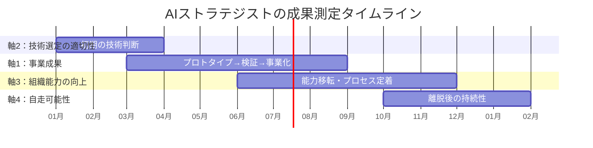

関与の初期（0〜3ヶ月）は、技術選定の適切性が最も重要な測定対象になる。中期（3〜12ヶ月）は、具体的な事業成果が測定の中心になる。後期（6〜12ヶ月）は、組織能力の向上が焦点となる。そして離脱後、自走可能性が最終的な評価軸となる。

---

## 7-4. 究極的な目標：「自分がいなくなっても回る状態」を作る

AIストラテジストの究極的な目標は、**自分がいなくても組織がAI戦略を自走できる状態を作ること**である。

これは逆説的に聞こえるかもしれない。「自分が不要になること」を目標にする専門家は珍しい。しかし、この原則こそがAIストラテジストの定義を他の職種から決定的に分離する。

### なぜ「自走」が究極目標なのか

**第一に、それが真の成果だから。** AIストラテジストの成果は「AIストラテジストが関与し続けること」ではない。「組織がAIを活用して事業成果を出し続けること」である。AIストラテジストがいないと機能しない組織は、依存構造を作っただけであり、真の価値創造ではない。

**第二に、コンサルティング業界の構造的欠陥を克服するため。** 従来のコンサルティングモデルには、「依存を作ることで継続的な収益を得る」というインセンティブが構造的に存在する。問題を完全に解決してしまうと、次の契約がない。だから、解決を完全にはせず、継続的な関与が必要な状態を維持する。AIストラテジストの定義は、この構造を明示的に否定する。

**第三に、FDEモデルとの一貫性。** PalantirのFDEは、クライアント環境にシステムを構築し、本番稼働の状態にして離脱する。FDEがいなくなっても、システムは動き続ける。AIストラテジストも同様に、組織にAI戦略の推進能力を構築し、その能力が自律的に機能する状態にして離脱する。

### 自走に向けた能力移転のプロセス

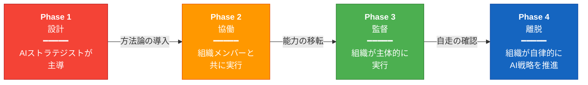

| フェーズ | AIストラテジストの関与 | 組織の状態 |
|---------|:-------------------:|-----------|
| Phase 1：設計 | 主導 | AIストラテジストが戦略を設計し、方法論を導入する |
| Phase 2：協働 | 伴走 | 組織のメンバーと共に実行し、方法論の運用方法を移転する |
| Phase 3：監督 | 助言 | 組織が主体的に実行し、AIストラテジストは品質管理と軌道修正を担う |
| Phase 4：離脱 | なし | 組織が自律的にAI戦略を推進する。AIストラテジストは次の組織へ |

Phase 4に到達した組織は、必要に応じてパターンC（アドバイザリー型）でAIストラテジストにアクセスできる。しかし、日常的なAI戦略の推進は組織自身が行う。

---

## 7-5. 本書の結論

本書は、「AIストラテジスト」という、世界のどこでも正式に定義されていなかった役割を、構造的に定義した。

**第1章**で、AIと組織の関係が根本的に変化し、新しい人材像が必要になったことを示した。

**第2章**で、6つの既存職種のいずれもこの変化に対応できないことを証明し、PalantirのFDEモデルが「外部専門家のあり方」を再定義したことを示した。

**第3章**で、AIストラテジストを定義する3つの原則——ベンダー独立性、成果コミット、埋め込み型関与——を定めた。

**第4章**で、3層＋基盤のコンピテンシーモデル——思想理解、事業設計、実行推進、越境力——を設計した。

**第5章**で、原則とコンピテンシーの2つのマトリクスにより、AIストラテジストが他のいかなる職種にも還元できない固有の存在であることを構造的に証明した。同時に、それが「上位」ではなく「交差」であること、他の職種との「補完関係」こそが実務上重要であることを明示した。

**第6章**で、3つの配置パターンと各ステークホルダーとの関係設計を具体的に示した。

**第7章（本章）**で、成果の4つの測定軸を定義し、AIストラテジストの究極的な目標が「自分がいなくても組織がAI戦略を自走できる状態を作ること」であることを論じた。

---

## 7-6. 最後に——定義は始まりであり、終わりではない

本書が提示したのは「定義」である。定義は地図に似ている。地図は地形を正確に描写するが、地図を描いただけでは目的地には到達しない。

この定義が価値を持つのは、実務の中で検証され、修正され、進化していく場合に限る。本書はCC BY 4.0ライセンスで公開されている。批判、修正提案、事例の追加、翻訳は歓迎する。

AIストラテジストという役割は、2026年の時点ではまだ萌芽的な存在である。しかし、第1章で示した3つの構造変化は加速しており、この空白を埋める人材の必要性は増している。本書の定義が、その空白を埋める一つの出発点となれば幸いである。

---

*本書は、以下のOSSプロジェクトと接続されている。AIストラテジストの各コンピテンシーレイヤーを深く理解するための参照文献として活用されたい。*

- **思想理解（Layer 1）の深堀り：** [The Silence of Intelligence](https://github.com/Leading-AI-IO/the-silence-of-intelligence) — Anthropic CEO ダリオ・アモディの思想を体系化
- **FDEモデルの構造分析：** [The Palantir Impact](https://github.com/Leading-AI-IO/palantir-ontology-strategy) — Palantir Foundryのオントロジー戦略を解剖
- **実行推進（Layer 3）の実践方法論：** [Depth & Velocity](https://github.com/Leading-AI-IO/depth-and-velocity) — 生成AI時代の新規事業開発方法論

---

## Author & Maintainer
**Satoshi Yamauchi** (山内 怜史) 
*(Business Designer & AI Strategist at SunAsterisk.inc)* 
**[📒 Read my insights on Note](https://note.com/satoshi_yamauchi).** 
*(Founder / AI Strategist at Leading.AI)* 
This project is part of the research by Leading.AI. 
**[🌐 Visit Leading.AI Official Website](https://www.leading-ai.io/)** 
*(For consulting inquiries and strategic partnership)* 

---

## 📝 License

This work is licensed under a [Creative Commons Attribution 4.0 International License](https://creativecommons.org/licenses/by/4.0/).
© 2026 Satoshi Yamauchi / Leading AI — Licensed under CC BY 4.0

